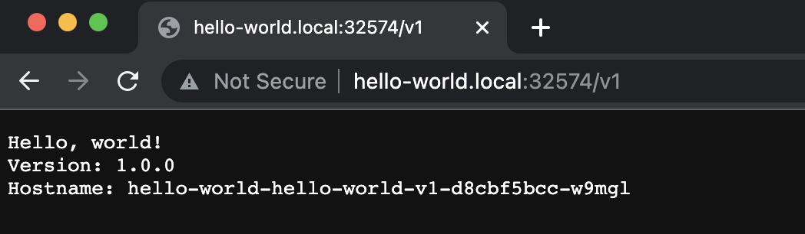
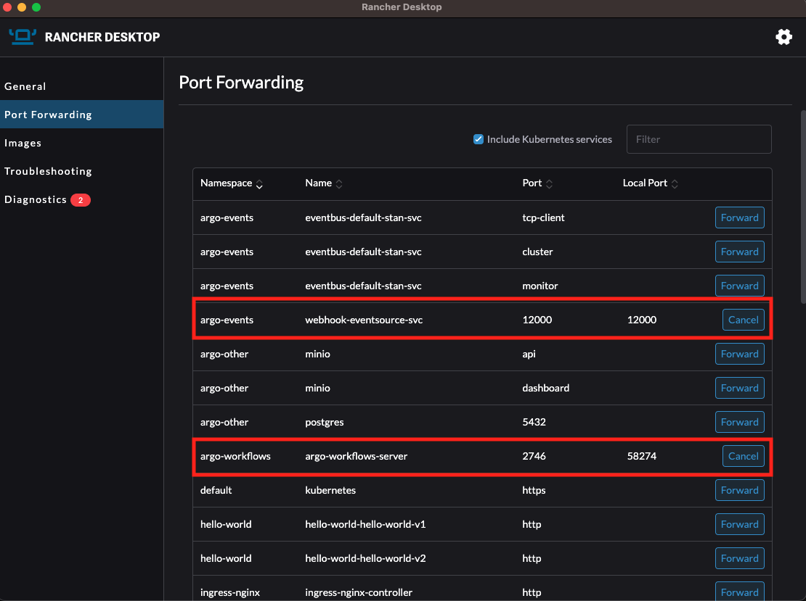

# FilmDrop Kubernetes Terraform Infrastructure Modules

This repository contains the packaging of FilmDrop terraform modules with Kubernetes.

## Pre-requisites

Before starting local development, you will need to install the following packages:
* terraform >= 1 (Recommed using latest version 1.3.9)
* [Kubernetes Development Tools](https://element84.atlassian.net/wiki/spaces/ES/pages/3013804035/Local+k8s+development#Ways-to-run-a-local-k8s-cluster)
* Linkerd CLI

The easiest way to install terraform on Mac is to use Homebrew and tfenv. TF Env is a version
manager for terraform. To inistall latest terraform via tfenv in a Mac and Homebrew, run
the following commands:
```
brew install tfenv
tfenv install latest
tfenv use latest
```

Refer to [tfenv](https://github.com/tfutils/tfenv) official documentation for more details.

Also, check the [Terraform Registry](https://registry.terraform.io/) for more Terraform guidelines about how to use terraform.

Linkerd is the Service Mesh of choice for the Local Kubernetes Development environment.

To install the Linkerd CLI manually, run:

```
curl --proto '=https' --tlsv1.2 -sSfL https://run.linkerd.io/install | sh
```

Do not run the additional steps that the Linkerd installation will suggest. Refer to [Linkerd](https://linkerd.io/2.12/overview/) official documentation for more details.
<br><br>

## Starting your local development environment

### Run a local kubernetes cluster
First make sure that your local Kubernetes cluster is running, if you need help creating your local
Kubernetes cluster, check the  [Kubernetes Development Tools](https://element84.atlassian.net/wiki/spaces/ES/pages/3013804035/Local+k8s+development#Ways-to-run-a-local-k8s-cluster) wiki.

If you use rancher-desktop or other k3s, make sure you have disabled the traefik ingress. For rancher-desktop,
this can be disabled under the kubernetes settings. The result of enabling traefik will be a conflict with the
nginx ingress controller, thus the ingress-nginx controller pods won't be able to start.

<p align="center">
  
</p>
<br>

#### Recommended VM Settings

When testing locally it's advised to use a virtual machine with at least 4 CPUs and 6 GB of memory (RAM). Also, make sure that your MacOS is updated to the latest version (i.e. perform all software updates related to the OS). This can resolve some issues with deployment that arise due to the VM that runs the Kubernetes cluster running out of memory as the Terraform modules are deployed.

In rancher-desktop you can change this setting under Preferences -> Virtual Machine.

<p align="center">
  
</p>
<br>

### Modify the [local.tfvars](./local.tfvars)
Every customization input for your local environment will go in the [local.tfvars](./local.tfvars) file.

Within the [local.tfvars](./local.tfvars) file, it is important that you define the following kuberenetes parameters:
```
kubernetes_config_file = "~/.kube/config"
kubernetes_config_context = "rancher-desktop"
```

The `kubernetes_config_file` should point to the path of your kubernetes config file, while the `kubernetes_config_context` should identify your kubernetes context
depending on your [Kubernetes Development Tools](https://element84.atlassian.net/wiki/spaces/ES/pages/3013804035/Local+k8s+development#Ways-to-run-a-local-k8s-cluster). For example, Rancher Desktop will likely use `kubernetes_config_context = "rancher-desktop"` while Docker Desktop will use `kubernetes_config_context = "docker-desktop"`.

### Start your environment via Terraform
1. First step is to initialize terraform via:
```
terraform init
```

The terraform init should pull the providers needed to run your terraform code.

2. Validate your terraform code with:
```
terraform validate
```

If your terraform is valid, the validate command will respond with `Success! The configuration is valid.`

3. Run a terraform plan
```
terraform plan -var-file=local.tfvars
```

The terraform plan will give you a summary of all the changes terraform will perform prior to deploying
any change.

4.  Run terraform apply
```
terraform apply -var-file=local.tfvars
```

The terraform apply will deploy the changes, but before doing so, terraform will perform an additional plan
and ask you for a confirmation, for wich you need to answer `yes` to proceed with the deployment.

```
Do you want to perform these actions?
  Terraform will perform the actions described above.
  Only 'yes' will be accepted to approve.

Enter a value: yes
```

The deployment will take 5-10 minutes to complete, and if it succeeds, your local environment should be up!
<br><br>

### Running an Argo workflow

<p align="center">
  
</p>
<br>

Argo Workflows will also get deployed onto the cluster as a part of this deployment. Its components will get deployed into two separate namespaces: `argo-workflows` and `argo-other`. The pods that will be spun up where workflows execute will run in the `argo-workflows` namespace; the Postgres database where the workflow archive is stored and the MinIO object storage where any logs from the workflow are put both run on pods inside the `argo-other` namespace.

Once the local environment is up and running, you can run the provided sample workflow in the file 'argo-workflow-sample.yaml' by going to the command line (Terminal) window and executing the below command:

```
argo submit -n argo-workflows --watch <FULL PATH TO THE SAMPLE WORKFLOW YAML FILE>
```

So, if for example, the workflow YAML file is located at ```./examples/argo/argo-workflow-sample.yaml```, then the command would be:
```
argo submit -n argo-workflows --watch ./examples/argo/argo-workflow-sample.yaml
```

Alternatively, you can go into the directory containing this file and simply pass the name of the file (along with its extension) to the above command.

You will see the workflow running in the command line and if everything goes well, it should successfully execute.

You can see the status of any currently running or previously run workflow by port-forwarding the Argo Server UI to a port on your machine. You can do this easily using Rancher Desktop (via the Port Forwarding section of the console) if that is the K8s tool that you are using. By default, the Argo Server UI runs on port 2746 inside the cluster. You can also do this using `kubectl`.

For example, to port-forward the Argo Server UI onto a local port 50000 on your machine:

```
kubectl -n argo-workflows port-forward deployment/argo-workflows-server 2746:50000
```


You can observe the log files that were created by the workflow by opening up the MinIO console by port-forwarding the MinIO dashboard to a port on your machine. By default, the MinIO dashboard runs on port 9001 inside the cluster. For example, to port-forward onto a local port 60000 on your machine:
```
kubectl -n argo-other port-forward deployment/minio 9001:60000
```

and then go to localhost:50000 and localhost:60000, respectively, to see the different consoles.

The username and password for the MinIO console are `admin` and `password`, respectively.

When the Argo Server UI opens up, you might have to click on the 'x' next to the namespace if there is already a value in the namespace field.

Note: The workflows you run should have `serviceAccountName: argo-workflow` within their `spec` declaration in the YAML file in order for the workflow to have the proper permissions to run. Also, in order to see the logs in MinIO, you should have the `archiveLogs: true` within the `spec` declaration as well. For example:

```
spec:
  serviceAccountName: argo-workflow # set this so the proper permissions are assigned
  archiveLogs: true # enables logs for this workflow
```
<br>

### Included in the local environment:

<p align="center">
  
</p>
<br>

### Linkerd

[Linkerd](https://linkerd.io/) is a service mesh, and Terraform will deploy the service mesh along with some visualization tools.

For example, after the terraform apply, you shoul be able to see the local Linkerd dashboard by running:
```
linkerd viz dashboard &
```

<p align="center">
  
</p>
<br>

### Nginx ingress proxy

An nginx ingress proxy has been added by default to the local development environment, you should be able to go
to http://localhost/ and see the default ngnix page not found.

<p align="center">
  
</p>
<br>

### Two load balanced test applications

Two test applications have been deployed, with the specifications in the [hello_world.tf](./hello_world.tf) file.

To access these applications, first you will need to modify your local `/etc/hosts` page and add the following:
```
127.0.0.1 hello-world.local
```

Next we will need to find the Nginx HTTP local NodePort,
to find the port, run the following command:
```
kubectl get svc -n ingress-nginx ingress-nginx-controller
```

Now, you should be able to see the two applications, with the ingress path based routing.

<p align="center">
  
</p>
<br>

First access the default application by going to `http://hello-world.local:{NGINX_NODE_PORT}`

<p align="center">
  
</p>
<br>

For accessing
application 1, you can go to: `http://hello-world.local:{NGINX_NODE_PORT}/v1`

<p align="center">
  
</p>
<br>

For accessing application 2, you can go to: `http://hello-world.local:{NGINX_NODE_PORT}/v2`

<p align="center">
  
</p>
<br>

### Monitoring

The local development environment includes resources for aggregating and visualizing logs and metrics. More information is available [here](./modules/monitoring/README.md).

## Re-creating your local environment

Depending on which tool you use to run Kubernetes, it is possible that you will need to re-create your
local environment after rebooting your local computer or after a tool upgrade. You should check your
Kubernetes tool of choice, to try to perform a factory reset when debugging an issue while you find that
your local environment is broken.

If for some reason you need to re-create your local environment, start by destroying the terraform state
by executing:
```
terraform destroy
```

Terraform will perform a plan and ask you to confirm the destroy of all the resources on the terraform
state. You will need to answer `yes` to proceed.
```
Do you really want to destroy all resources?
  Terraform will destroy all your managed infrastructure, as shown above.
  There is no undo. Only 'yes' will be accepted to confirm.

  Enter a value: yes
```

<sub><sup>There is a Loki pod that may take longer to terminate than the default terraform timeout. It should eventually terminate and be removed from the cluster. Because of this the `monitoring` namespace has been deployed in a way that it will not be deleted on a terraform destroy. This will not interfere with subsequent deployments.</sup></sub>

After you have destroyed your environment, go back to the [Start your environment via Terraform](#start-your-environment-via-terraform) section for instructions on how to run your local development environment.

<br><br>
# `flop` CLI
## What is `flop`?

`flop` is a utility for creating and interacting with FilmDrop-on-K8s test environments. The name is a portmanteau of FiLmdrOP.

## Dependencies and Setup

* Bash &nbsp;<sub><sup>(versions tested: 5, 3.2)<sub><sup>
* Container Manager &nbsp;<sub><sup>(e.g. Docker Desktop, Colima)<sub><sup>
* `kind` and/or `k3d`
* kubectl
* terraform

On Mac, install any missing dependencies with:

```shell
brew install colima terraform k3d kubectl
colima start
```

Other useful tools:

* helm cli
* linkerd (required for current tests)
* lima (if using colima, sometimes helpful for lower-level troubleshooting)
* shellcheck (for checking `flop` scripts when developing)
<br><br>

## Using `flop`

### Run `flop` to list all of the available features:

```shell
./flop
```

### A typical example of a `flop` workflow:

```shell
CLUSTER="$(flop create)"  # stdout contains cluster name

flop terraform "${CLUSTER}" apply -var-file ./flop.tfvars -auto-approve

flop kubectl "${CLUSTER}" get svc -A

flop test "${CLUSTER}"

flop destroy "${CLUSTER}"
```

### If things go sideways, you can delete the entire state:

```shell
flop destroy --all
```
<br>

## `flop` tests

Right now the test functionality is pretty limited. We should likely consider
using a test framework with more expressivity and control like `pytest`. That
said, the `test` command will run any executables found in the `flop.d/tests`
directory.

Please extend the existing test scripts or add new ones, as necessary.
<br><br>
## Resource Requirements

Operating a complex cluster within a single VM can be resource limited, and
strange behavior can result. For example, the default resource allocation for a
colima VM is barely adequate for a single cluster with the current pod count.
Adding a second cluster without increasing resources to the VM will cause
instability, such as network requests timing out and services being
unresponsive.

In cases where cluster behavior is unexplainably weird, consider that it might
be a resource issue within the VM. Sometimes destroying and re-creating the VM
with no state helps free up resources without having to allocate more, but as
the cluster requirements grow we will need to keep an eye on specific
requirements.


<br><br>

## Workflow Operations

To learn more about the motivations of Workflow Operations with Argo Events, take a look at: https://element84.atlassian.net/wiki/spaces/ES/pages/3068035079/SWOOP+Workflow+Operations

In this section we want to provide a guide of how to run the Workflow Operations demo with Argo Events.

Start by running a terraform init, plan and apply with your local or remote tfvars
```
terraform init -upgrade
```
```
terraform plan -var-file=local.tfvars
```
```
terraform apply -var-file=local.tfvars
```

After the terraform apply succeeds proceed to perform a port forwarding for the webhook-eventsource-svc and the argo-workflows-server.



Log into the Argo Workflow Server, by accessing `http://localhost:<ARGO_WORKFLOW_SERVER_PORT>` and head to the Event Flow panel, uncheck the `undefined` namespace, and you should see two Argo Events Pipelines (you may need to scroll down).


Open a terminal window, find the workflow-event-tracker-sensor pod name and tail the logs of that pod. The pod will log all workflow events happening on the same namespace.


Open a separate terminal window, and call the run workflow webhook to start a new workflow.


If you head back to the Argo Workflow Server Event Flow page `http://localhost:<ARGO_WORKFLOW_SERVER_PORT>/event-flow/?showWorkflows=true` you should see a new workflow running and eventually succeeding.


Finally, if you look back at the terminal that you used to tail the logs of the workflow-event-tracker-sensor you should see all the events of the workflow that just ran.


