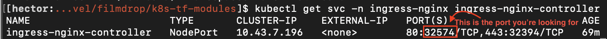
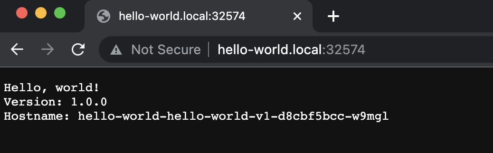
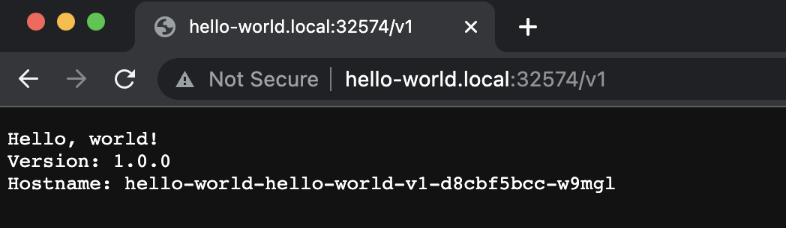
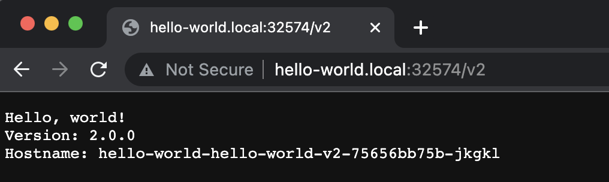

# Hello world test application

Two test applications have been deployed, with the specifications in the [hello_world.tf](./hello_world.tf) file.

To access these applications, first you will need to modify your local `/etc/hosts` page and add the following:
```
127.0.0.1 hello-world.local
```

Next we will need to find the Nginx HTTP local NodePort,
to find the port, run the following command:
```
kubectl get svc -n ingress-nginx ingress-nginx-controller
```

Now, you should be able to see the two applications, with the ingress path based routing.

<p align="center">
  
</p>
<br>

First access the default application by going to `http://hello-world.local:{NGINX_NODE_PORT}`

<p align="center">
  
</p>
<br>

For accessing
application 1, you can go to: `http://hello-world.local:{NGINX_NODE_PORT}/v1`

<p align="center">
  
</p>
<br>

For accessing application 2, you can go to: `http://hello-world.local:{NGINX_NODE_PORT}/v2`

<p align="center">
  
</p>
<br>

## Installation

1. First, initialize terraform:

```bash
terraform init
```

2. Validate that the terraform resources are valid. If your terraform is valid the validate command will respond with _"Success! The configuration is valid."_

```bash
terraform validate
```

3. Run a terraform plan. The terraform plan will give you a summary of all the changes terraform will perform prior to deploying any change.

```bash
terraform plan
```

4. Deploy the changes by applying the terraform plan. You will be asked to confirm the changes and must respond with _"yes"_.

```bash
terraform apply
```

<sub><sup>Instructions for installing individual monitoring services can be found in their specific README files.</sup></sub>
