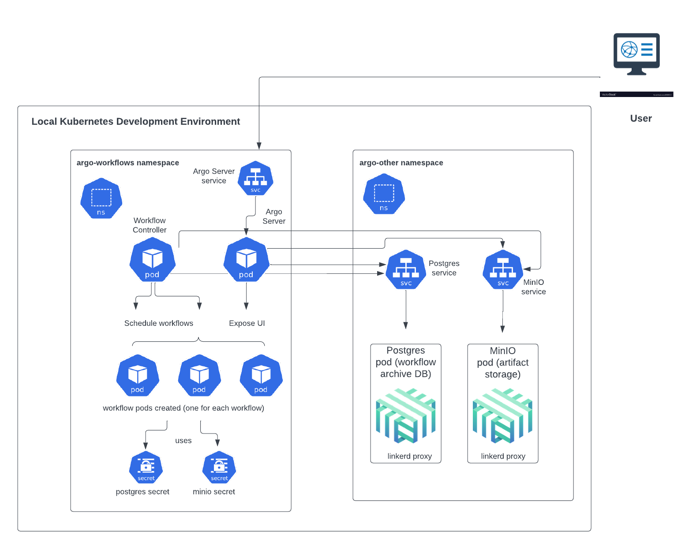

# Workflow Orchestration

## Running an Argo workflow

<p align="center">
  
</p>
<br>

Argo Workflows will also get deployed onto the cluster as a part of this deployment. Its components will get deployed into two separate namespaces: `argo-workflows` and `argo-other`. The pods that will be spun up where workflows execute will run in the `argo-workflows` namespace; the Postgres database where the workflow archive is stored and the MinIO object storage where any logs from the workflow are put both run on pods inside the `argo-other` namespace.

Once the local environment is up and running, you can run the provided sample workflow in the file 'argo-workflow-sample.yaml' by going to the command line (Terminal) window and executing the below command:

```
argo submit -n argo-workflows --watch <FULL PATH TO THE SAMPLE WORKFLOW YAML FILE>
```

So, if for example, the workflow YAML file is located at ```./examples/argo/argo-workflow-sample.yaml```, then the command would be:
```
argo submit -n argo-workflows --watch ./examples/argo/argo-workflow-sample.yaml
```

Alternatively, you can go into the directory containing this file and simply pass the name of the file (along with its extension) to the above command.

You will see the workflow running in the command line and if everything goes well, it should successfully execute.

You can see the status of any currently running or previously run workflow by port-forwarding the Argo Server UI to a port on your machine. You can do this easily using Rancher Desktop (via the Port Forwarding section of the console) if that is the K8s tool that you are using. By default, the Argo Server UI runs on port 2746 inside the cluster. You can also do this using `kubectl`.

For example, to port-forward the Argo Server UI onto a local port 50000 on your machine:

```
kubectl -n argo-workflows port-forward deployment/argo-workflows-server 2746:50000
```


You can observe the log files that were created by the workflow by opening up the MinIO console by port-forwarding the MinIO dashboard to a port on your machine. By default, the MinIO dashboard runs on port 9001 inside the cluster. For example, to port-forward onto a local port 60000 on your machine:
```
kubectl -n argo-other port-forward deployment/minio 9001:60000
```

and then go to localhost:50000 and localhost:60000, respectively, to see the different consoles.

The username and password for the MinIO console are `admin` and `password`, respectively.

When the Argo Server UI opens up, you might have to click on the 'x' next to the namespace if there is already a value in the namespace field.

Note: The workflows you run should have `serviceAccountName: argo-workflow` within their `spec` declaration in the YAML file in order for the workflow to have the proper permissions to run. Also, in order to see the logs in MinIO, you should have the `archiveLogs: true` within the `spec` declaration as well. For example:

```
spec:
  serviceAccountName: argo-workflow # set this so the proper permissions are assigned
  archiveLogs: true # enables logs for this workflow
```
<br>

## Installation

1. First, initialize terraform:

```bash
terraform init
```

2. Validate that the terraform resources are valid. If your terraform is valid the validate command will respond with _"Success! The configuration is valid."_

```bash
terraform validate
```

3. Run a terraform plan. The terraform plan will give you a summary of all the changes terraform will perform prior to deploying any change.

```bash
terraform plan
```

4. Deploy the changes by applying the terraform plan. You will be asked to confirm the changes and must respond with _"yes"_.

```bash
terraform apply
```
