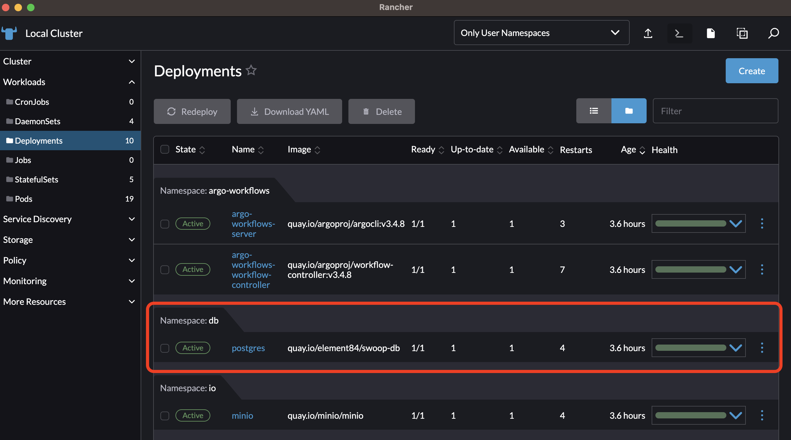
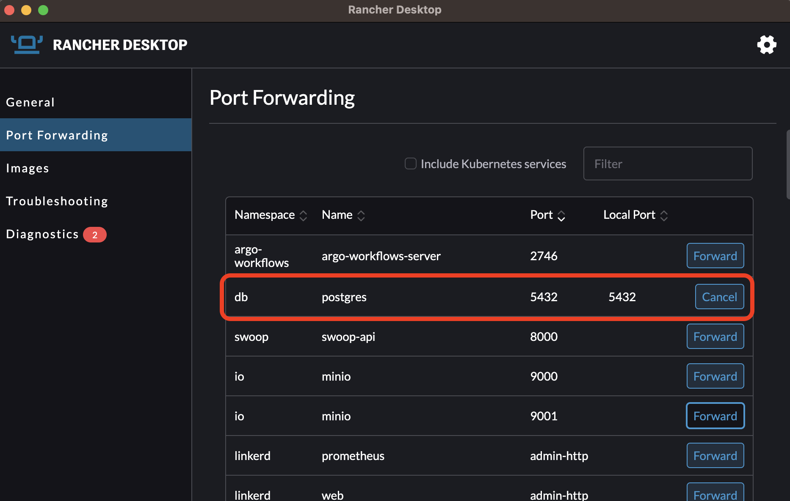

# DB

This module defines the resources required to support a state database for SWOOP: STAC Workflow Open Orchestration Platform. This includes:

- [Postgres](./postgres/README.md): a database service to store the state database of [SWOOP API](https://github.com/Element84/swoop). The helm chart for MinIO can be found at: [https://github.com/Element84/filmdrop-k8s-helm-charts/](https://github.com/Element84/filmdrop-k8s-helm-charts/)

<br></br>
***To run Postgres with SWOOP API check the [SWOOP API Guide](../swoop/Readme.md).***

<br></br>
## Installation
***Please run the following steps at the top level of the filmdrop-k8s-tf-modules project.***

***For recommended VM settings and other kubernetes guidance, please check the [Operations Guide](../../operations/Operations_Guide.md)***

1. First, initialize terraform:

```bash
terraform init
```

2. Validate that the terraform resources are valid. If your terraform is valid the validate command will respond with _"Success! The configuration is valid."_

```bash
terraform validate
```

3. Run a terraform plan. The terraform plan will give you a summary of all the changes terraform will perform prior to deploying any change.

```bash
terraform plan -var-file=local.tfvars
```

4. Deploy the changes by applying the terraform plan. You will be asked to confirm the changes and must respond with _"yes"_.

```bash
terraform apply -var-file=local.tfvars
```

## Port-forwarding Postgres
Once the chart has been deployed, you should see at least 1 deployment for postgres.
<br></br>
<p align="center">
  
</p>
<br></br>

In order to start using the services used by this helm chart, you will need to port-forward `postgres` onto localhost port `5432`.
<br></br>
<p align="center">
  
</p>
<br></br>

## Test connection to postgres database

For a comprehensive set of steps initialize and use the postgres database, please refer to the swoop-db repo [https://github.com/Element84/swoop-db](https://github.com/Element84/swoop-db).

To test the connection to the postgres database, export the following postgres environment variables:
```
export PGHOST="127.0.0.1"
export PGUSER="`helm get values postgres -n db -a -o json | jq -r .postgres.service.dbUser | base64 --decode`"
export PGPASSWORD="`helm get values postgres -n db -a -o json | jq -r .postgres.service.dbPassword | base64 --decode`"
export PGPORT="`helm get values postgres -n db -a -o json | jq -r .postgres.service.port`"
export PGDATABASE="`helm get values postgres -n db -a -o json | jq -r .postgres.service.dbName`"
export PGAUTHMETHOD="trust"

```

Then connect to the postgres database by running a psql command:
```
$ psql -p $PGPORT -U $PGUSER $PGDATABASE

psql (14.7 (Homebrew), server 15.3 (Debian 15.3-1.pgdg110+1))
WARNING: psql major version 14, server major version 15.
         Some psql features might not work.
Type "help" for help.

swoop=#
```

## Uninstall postgres

To uninstall the release, do `terraform destroy`.
