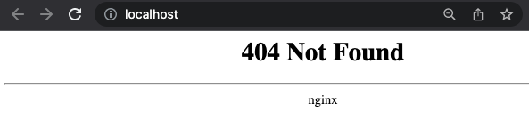

### Nginx ingress proxy

An nginx ingress proxy has been added by default to the local development environment, you should be able to go
to http://localhost/ and see the default ngnix page not found.

  

 
