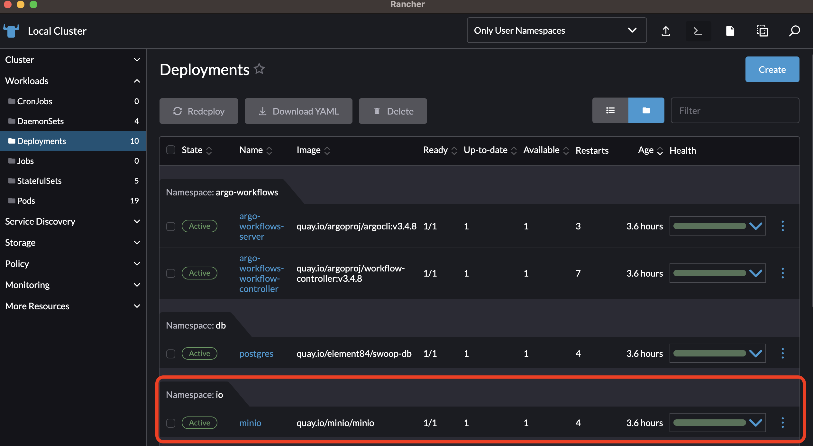
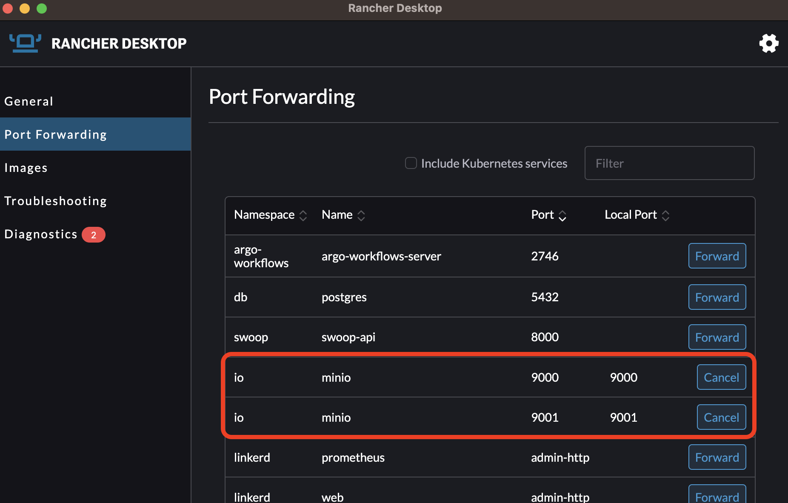
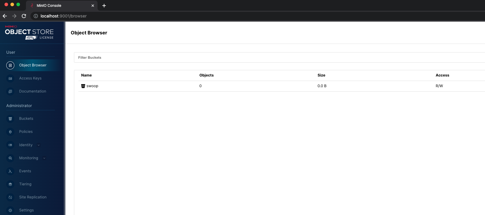

# IO

This module defines the resources required to support object storage for SWOOP: STAC Workflow Open Orchestration Platform. This includes:

- [MinIO](./minio/README.md): an object storage service for storing artifacts from the [SWOOP API](https://github.com/Element84/swoop). The helm chart for MinIO can be found at: [https://github.com/Element84/filmdrop-k8s-helm-charts/](https://github.com/Element84/filmdrop-k8s-helm-charts/)


<br></br>
***To run MinIO with SWOOP API check the [SWOOP API Guide](../swoop/README.md).***

<br></br>
## Installation
***Please run the following steps at the top level of the filmdrop-k8s-tf-modules project.***

***For recommended VM settings and other kubernetes guidance, please check the [Operations Guide](../../operations/Operations_Guide.md)***

***The commands below require you to be on top level directory of the filmdrop-k8s-tf-modules project.***

1. First, update [local.tfvars](../../local.tfvars) or create your own .tfvars:
* For enabling minio you will need to enable at least the following from your tfvars:
```
deploy_minio              = true
```
* If you would like to automatically expose the minio ports in your local environment, you can enable an ingress-nginx that has been provided for this purpose. First for enabling the ingress-nginx module, make sure to update [local.tfvars](../../local.tfvars) or your own .tfvars with the following:
```
deploy_ingress_nginx      = true
```
* Lastly, if you do decide to use the ingress-nginx load balancer to expose your application, you can control which local port would you want to forward the service port via the nginx_extra_values variable in the [local.tfvars](../../local.tfvars) or your own .tfvars:
```
nginx_extra_values = {
  "tcp.<LOCAL_MACHINE_PORT>" = "<NAMESPACE>/<SERVICE_NAME>:<SERVICE_PORT>"
}
```
* For minio and the default nginx_extra_values configuration would look like:
```
nginx_extra_values = {
  "tcp.9000"  = "io/minio:9000"
  "tcp.9001"  = "io/minio:9001"
}
```

2. Next, initialize terraform:

```bash
terraform init
```

3. Validate that the terraform resources are valid. If your terraform is valid the validate command will respond with _"Success! The configuration is valid."_

```bash
terraform validate
```

4. Run a terraform plan. The terraform plan will give you a summary of all the changes terraform will perform prior to deploying any change. You will a need 

```bash
terraform plan -var-file=local.tfvars
```

5. Deploy the changes by applying the terraform plan. You will be asked to confirm the changes and must respond with _"yes"_.

```bash
terraform apply -var-file=local.tfvars
```

## Connecting to MinIO

### Connecting with Ingress Nginx

If you decided to enable the ingress-nginx module, then you do not need to do anything else to expose your service ports! You should be able to reach out your services via your localhost without the need of port-forwarding. For example:
```
minio:9000 -> localhost:9000
minio:9001 -> localhost:9001
```

### Connecting without Ingress Nginx

Once the chart has been deployed, you should see at least 1 deployment for minio.
<br></br>
<p align="center">
  
</p>
<br></br>

In order to start using the services used by this helm chart, you will need to port-forward `minio` onto localhost port `9000` & `9001`.

Via Rancher Desktop:
<br></br>
<p align="center">
  
</p>
<br></br>

or via terminal:
```
kubectl port-forward -n io svc/minio 9000:9000 &
kubectl port-forward -n io svc/minio 9001:9001 &
```

## Setting up MinIO CLI


### Install First the MinIO client by running:
```
brew install minio/stable/mc
```

### Then set the MinIO alias, find the ACCESS_KEY and SECRET_KEY by quering the Helm values
```
export MINIO_ACCESS_KEY=`kubectl get secrets -n io minio-secret-credentials --template={{.data.access_key_id}} | base64 -D`
export MINIO_SECRET_KEY=`kubectl get secrets -n io minio-secret-credentials --template={{.data.secret_access_key}} | base64 -D`
mc alias set minio http://127.0.0.1:9000 $MINIO_ACCESS_KEY $MINIO_SECRET_KEY
```

### Test MinIO connection by running:
```
$ mc admin info minio

●  127.0.0.1:9000
   Uptime: 4 minutes
   Version: 2023-06-02T23:17:26Z
   Network: 1/1 OK
   Drives: 1/1 OK
   Pool: 1

Pools:
   1st, Erasure sets: 1, Drives per erasure set: 1

0 B Used, 1 Bucket, 0 Objects
1 drive online, 0 drives offline
```

## Log into MinIO Dashboard
Retrieve username by running:
```
kubectl get secret -n io minio-secret-credentials -o jsonpath='{.data.access_key_id}' | base64 -D
```

Retrieve password by running:
```
kubectl get secret -n io minio-secret-credentials -o jsonpath='{.data.secret_access_key}' | base64 -D
```

Open MinIO dashboard by opening your browser on [http://localhost:9001/](http://localhost:9001/) and logging into MinIO using the credentials above:
<p align="center">
  
</p>
<br></br>


## Uninstall minio

To uninstall the release, do `terraform destroy -var-file=local.tfvars`.
