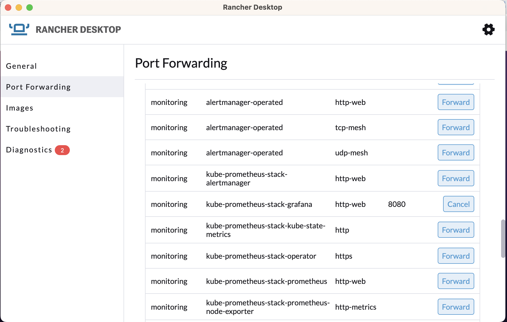
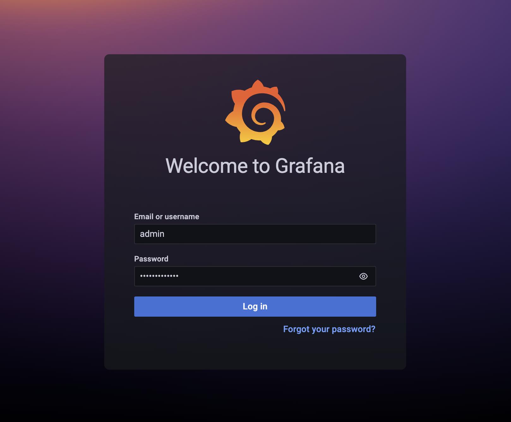
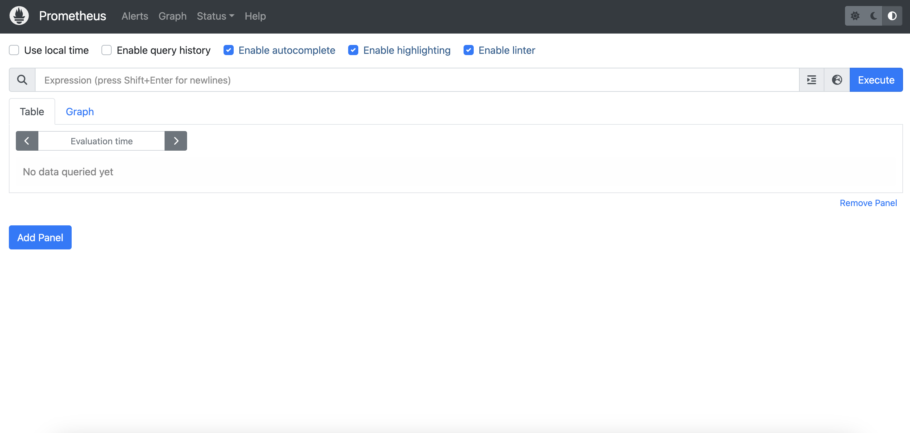
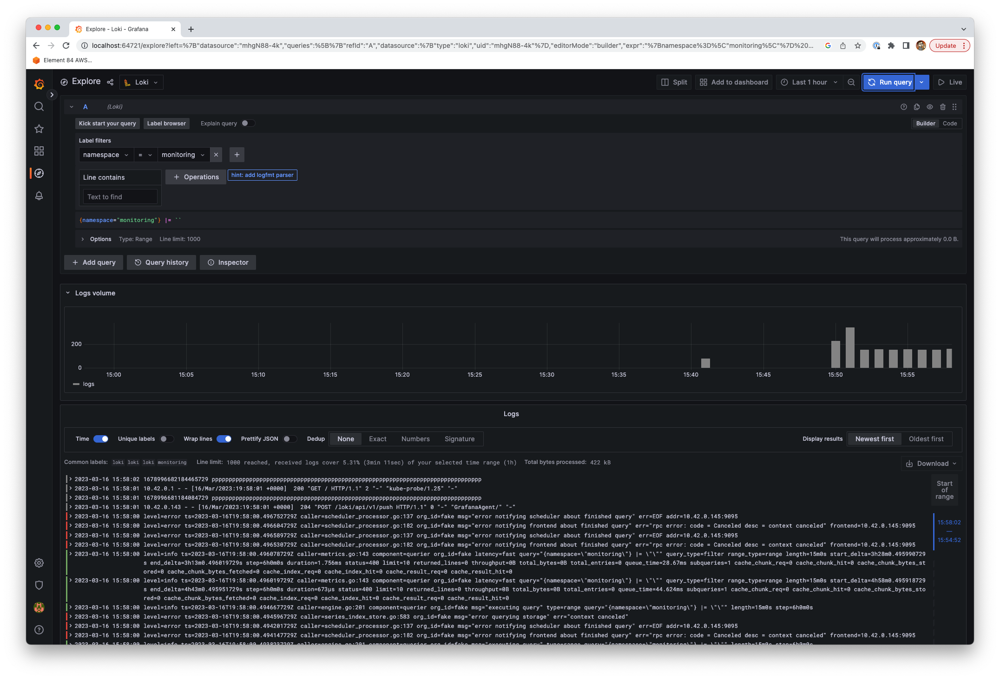

# Monitoring

This module defines the resources required for monitoring the state of system. This includes:

- [Grafana](https://grafana.com/grafana/) for visualization and dashboards.
- [Prometheus](https://grafana.com/oss/prometheus/) for metric monitoring.
- [Loki](https://grafana.com/oss/loki/) for log storage and disovery.
- [Promtail](https://grafana.com/docs/loki/latest/clients/promtail/) for log scraping.

## Installation

1. First, initialize terraform:

```bash
terraform init
```

2. Validate that the terraform resources are valid. If your terraform is valid the validate command will respond with _"Success! The configuration is valid."_

```bash
terraform validate
```

3. Run a terraform plan. The terraform plan will give you a summary of all the changes terraform will perform prior to deploying any change.

```bash
terraform plan
```

4. Deploy the changes by applying the terraform plan. You will be asked to confirm the changes and must respond with _"yes"_.

```bash
terraform apply
```

## Resources

### Grafana

Charts and visualizations for viewing system usage and performance are available in the Grafana Dashboard. For developer access to the Grafana dashboard, first enable port forwarding:



or run this on the command line:

```bash
kubectl port-forward --namespace monitoring svc/kube-prometheus-stack-grafana 8080:3009
```

This will allow you to access the Grafana dashboard at `http://localhost:8080`


If you don't already have your Grafana credentials, they can be obtained with:
```
# Username
kubectl get secret kube-prometheus-stack-grafana -n monitoring -o jsonpath="{.data.admin-user}" | base64 --decode

# Password
kubectl get secret kube-prometheus-stack-grafana -n monitoring -o jsonpath="{.data.admin-password}" | base64 --decode
```

<br>And use those credentials to login at: &nbsp;&nbsp;<b>localhost:{port_from_above}</b>



Loki and Prometheus have automatically been added as data sources to Grafana.

### Prometheus

The Prometheus server UI can be accessed by port-forwarding to a localhost port:

```bash
kubectl port-forward --namespace monitoring svc/kube-prometheus-stack-prometheus 9090:9090
```

You could also port-forward the `kube-prometheus-stack-prometheus` service using the Rancher Desktop UI. This will allow you to access the Prometheus dashboard at `http://localhost:9090`

There is no login needed. Observe/monitor the cluster status by clicking on 'Status' on the top ribbon and exploring the various options on that tab.



### Loki

To visualize basic Loki monitoring logs:

In Grafana click "Explore" on the left-side menu. For _Label Filters_ enter "namespace = monitoring". Click "Run Query" and you should see logs from the Loki instance:



### Promtail

The promtail agent will be installed as a DaemonSet and configured with the default settings to scrape logs from any pod in the cluster. The logs will be sent to and stored in Loki.
