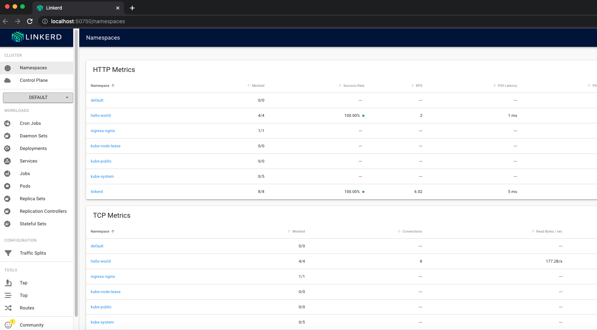

# Linkerd

[Linkerd](https://linkerd.io/) is a service mesh, and Terraform will deploy the service mesh along with some visualization tools.

For example, after the terraform apply, you shoul be able to see the local Linkerd dashboard by running:
```
linkerd viz dashboard &
```

<p align="center">
  
</p>
<br>
