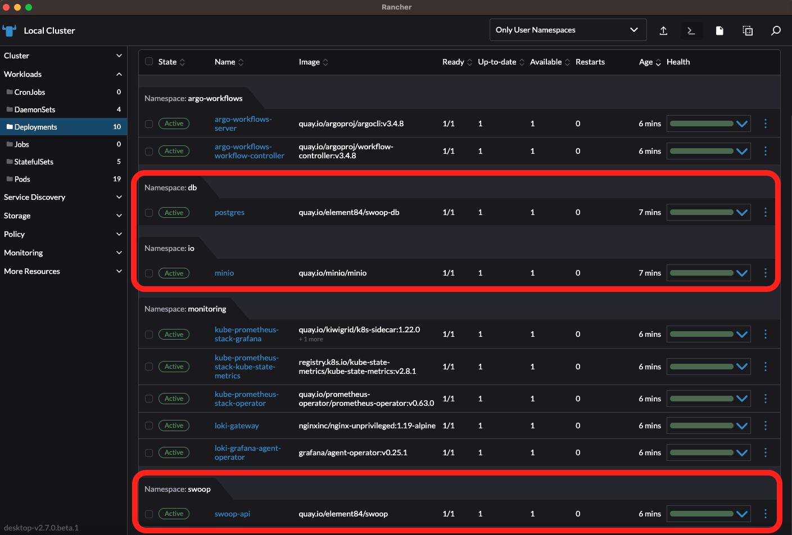
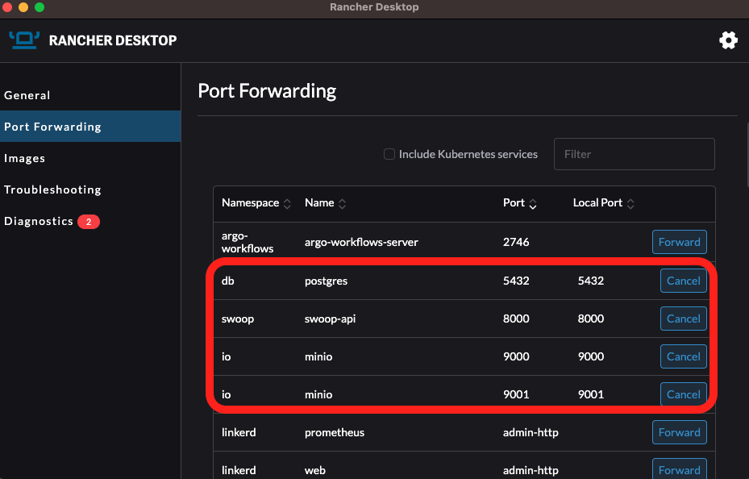
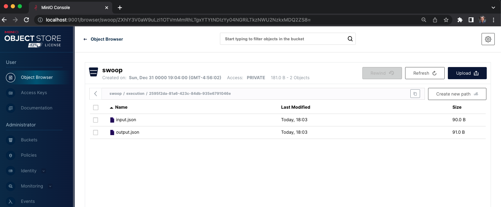

# SWOOP

This module defines the resources required for the SWOOP: STAC Workflow Open Orchestration Platform. This includes:

- [SWOOP API](./swoop-api/README.md): a FastAPI application that acts as an interface for clients to interact with the processing pipeline and state database. The helm chart for the SWOOP API can be found at: [https://github.com/Element84/filmdrop-k8s-helm-charts/](https://github.com/Element84/filmdrop-k8s-helm-charts/)
- [MinIO](../io/minio/README.md): an object storage service for storing artifacts from the [SWOOP API](https://github.com/Element84/swoop). The helm chart for MinIO can be found at: [https://github.com/Element84/filmdrop-k8s-helm-charts/](https://github.com/Element84/filmdrop-k8s-helm-charts/)
- [Postgres](../db/postgres/README.md): a database service to store the state database of [SWOOP API](https://github.com/Element84/swoop). The helm chart for MinIO can be found at: [https://github.com/Element84/filmdrop-k8s-helm-charts/](https://github.com/Element84/filmdrop-k8s-helm-charts/)


## Installation
***Please run the following steps at the top level of the filmdrop-k8s-tf-modules project.***

***For recommended VM settings and other kubernetes guidance, please check the [Operations Guide](../../operations/Operations_Guide.md)***

1. First, initialize terraform:

```bash
terraform init
```

2. Validate that the terraform resources are valid. If your terraform is valid the validate command will respond with _"Success! The configuration is valid."_

```bash
terraform validate
```

3. Run a terraform plan. The terraform plan will give you a summary of all the changes terraform will perform prior to deploying any change.

```bash
terraform plan -var-file=local.tfvars
```

4. Deploy the changes by applying the terraform plan. You will be asked to confirm the changes and must respond with _"yes"_.

```bash
terraform apply -var-file=local.tfvars
```

## Running SWOOP API
Once the chart has been deployed, you should see at least 3 deployments: postgres, minio and swoop-api.
<br></br>
<p align="center">
  
</p>
<br></br>

In order to start using the services used by this helm chart, you will need to port-forward `postgres` onto localhost port `5432`, port-forward `minio` onto localhost ports `9000` & `9001` and port-forward `swoop-api` onto localhost port `8000`.
<br></br>
<p align="center">
  
</p>
<br></br>

You will see now, that if you reach the swoop api [http://localhost:8000/](http://localhost:8000/), you should see a sample response:
```
$ curl http://localhost:8000/

{"title":"Example processing server","description":"Example server implementing the OGC API - Processes 1.0 Standard","links":[{"href":"http://localhost:8000/conformance","rel":"http://www.opengis.net/def/rel/ogc/1.0/conformance","type":"application/json","hreflang":null,"title":null}]}%
```
<br></br>

## API tests with Database

To test the API endpoints that make use of data in the postgres database, you will need to load data into the postgres state database or use [swoop-db](https://github.com/Element84/swoop-db) to initialize the schema and load test migrations.

If you want database sample data to test the API, run the following swoop-db commands on the postgres pods to apply the migrations and load the fixtures:
```
kubectl exec -it --namespace=db $(kubectl get pods -o=name --namespace=db | grep postgres) -- /bin/sh -c "swoop-db up"
kubectl exec -it --namespace=db $(kubectl get pods -o=name --namespace=db | grep postgres) -- /bin/sh -c "swoop-db load-fixture base_01"
```

After loading the database, you should be able to see the jobs in the swoop api jobs endpoint [http://localhost:8000/jobs/](http://localhost:8000/jobs/):
```
$ curl http://localhost:8000/jobs/

{"jobs":[{"processID":"action_2","type":"process","jobID":"81842304-0aa9-4609-89f0-1c86819b0752","status":"accepted","message":null,"created":null,"started":null,"finished":null,"updated":"2023-04-28T15:49:00+00:00","progress":null,"links":null,"parentID":"2595f2da-81a6-423c-84db-935e6791046e"},{"processID":"action_1","type":"process","jobID":"2595f2da-81a6-423c-84db-935e6791046e","status":"successful","message":null,"created":null,"started":null,"finished":null,"updated":"2023-04-28T15:49:03+00:00","progress":null,"links":null,"parentID":"cf8ff7f0-ce5d-4de6-8026-4e551787385f"}],"links":[{"href":"http://www.example.com","rel":null,"type":null,"hreflang":null,"title":null}]}%
```

## API tests with Object Storage
In order to load data into MinIO, follow these steps:

### Install First the MinIO client by running:
```
brew install minio/stable/mc
```

### Then set the MinIO alias, find the ACCESS_KEY and SECRET_KEY by quering the Helm values
```
export MINIO_ACCESS_KEY=`helm get values minio -n io -a -o json | jq -r .minio.service.accessKeyId | base64 --decode`
export MINIO_SECRET_KEY=`helm get values minio -n io -a -o json | jq -r .minio.service.secretAccessKey | base64 --decode`
mc alias set swoopminio http://127.0.0.1:9000 $MINIO_ACCESS_KEY $MINIO_SECRET_KEY
```

### Test MinIO connection by running:
```
$ mc admin info swoopminio

●  127.0.0.1:9000
   Uptime: 23 minutes
   Version: 2023-06-02T23:17:26Z
   Network: 1/1 OK
   Drives: 1/1 OK
   Pool: 1

Pools:
   1st, Erasure sets: 1, Drives per erasure set: 1

0 B Used, 1 Bucket, 0 Objects
1 drive online, 0 drives offline
```

### Load data into MinIO by running:
First clone the [https://github.com/Element84/swoop](https://github.com/Element84/swoop) repository locally, and then run the following from the top level of the your local swoop clone:

```
$ mc cp --recursive tests/fixtures/io/base_01/ swoopminio/swoop/execution/2595f2da-81a6-423c-84db-935e6791046e/

...fixtures/io/base_01/output.json: 181 B / 181 B ━━━━━━━━━━━━━━━━━━━━━━━━━━━━━━━━━━━━━━━━ 1.67 KiB/s 0s
```

### View your data on MinIO by opening your browser on [http://localhost:9001/](http://localhost:9001/) and logging into MinIO

Retrieve username by running:
```
helm get values minio -n io -a -o json | jq -r .minio.service.accessKeyId | base64 --decode
```

Retrieve password by running:
```
helm get values minio -n io -a -o json | jq -r .minio.service.secretAccessKey | base64 --decode
```

Open MinIO dashboard by opening your browser on [http://localhost:9001/](http://localhost:9001/) and logging into MinIO using the credentials above:
<p align="center">
  
</p>
<br></br>

### Test API with MinIO by running:
```
$ curl http://localhost:8000/jobs/2595f2da-81a6-423c-84db-935e6791046e/payload

{"process_id":"2595f2da-81a6-423c-84db-935e6791046e","payload":"test_input"}%
```

```
$ curl http://localhost:8000/jobs/2595f2da-81a6-423c-84db-935e6791046e/results

{"process_id":"2595f2da-81a6-423c-84db-935e6791046e","payload":"test_output"}%
```
<br></br>

## Uninstall swoop-api

To uninstall the release, do `terraform destroy`.
