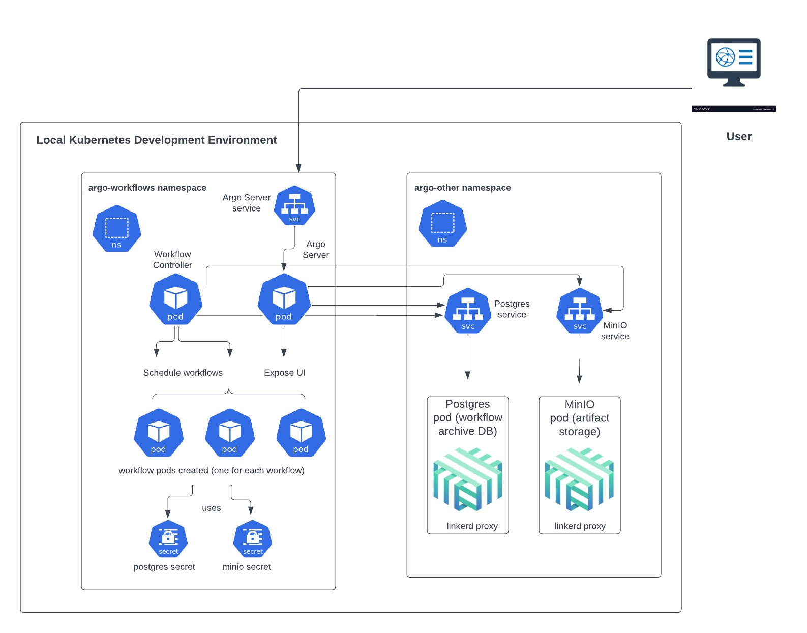

# SWOOP

This module defines the resources required for the SWOOP: STAC Workflow Open Orchestration Platform. This includes:

- [SWOOP API](./swoop-api/README.md): a FastAPI application that acts as an interface for clients to interact with the processing pipeline and state database. The helm chart for the SWOOP API can be found at: [https://github.com/Element84/filmdrop-k8s-helm-charts/](https://github.com/Element84/filmdrop-k8s-helm-charts/)
- [MinIO](../io/minio/README.md): an object storage service for storing artifacts from the [SWOOP API](https://github.com/Element84/swoop). The helm chart for MinIO can be found at: [https://github.com/Element84/filmdrop-k8s-helm-charts/](https://github.com/Element84/filmdrop-k8s-helm-charts/)
- [Postgres](../db/postgres/README.md): a database service to store the state database of [SWOOP API](https://github.com/Element84/swoop). The helm chart for MinIO can be found at: [https://github.com/Element84/filmdrop-k8s-helm-charts/](https://github.com/Element84/filmdrop-k8s-helm-charts/)


## Installation
***Please run the following steps at the top level of the filmdrop-k8s-tf-modules project.***

***For recommended VM settings and other kubernetes guidance, please check the [Operations Guide](../../operations/Operations_Guide.md)***

***The commands below require you to be on top level directory of the filmdrop-k8s-tf-modules project.***

1. First, update [local.tfvars](../../local.tfvars) or create your own .tfvars:
* For enabling swoop-api and it's dependent services you will need to enable at least the following from your tfvars:
```
deploy_swoop_api          = true
deploy_swoop_caboose      = true
deploy_db_migration       = true
deploy_argo_workflows     = true
deploy_postgres           = true
deploy_db_init            = true
deploy_minio              = true
```
* If you would like to automatically expose the swoop-api, minio and postgres ports in your local environment, you can enable an ingress-nginx that has been provided for this purpose. First for enabling the ingress-nginx module, make sure to update [local.tfvars](../../local.tfvars) or your own .tfvars with the following:
```
deploy_ingress_nginx      = true
```
* Lastly, if you do decide to use the ingress-nginx load balancer to expose your application, you can control which local port would you want to forward the service port via the nginx_extra_values variable in the [local.tfvars](../../local.tfvars) or your own .tfvars:
```
nginx_extra_values = {
  "tcp.<LOCAL_MACHINE_PORT>" = "<NAMESPACE>/<SERVICE_NAME>:<SERVICE_PORT>"
}
```
* For swoop-api, minio and postgres, the default nginx_extra_values configuration would look like:
```
nginx_extra_values = {
  "tcp.8000"  = "swoop/swoop-api:8000"
  "tcp.9000"  = "io/minio:9000"
  "tcp.9001"  = "io/minio:9001"
  "tcp.5432"  = "db/postgres:5432"
}
```

2. Next, initialize terraform:

```bash
terraform init
```

3. Validate that the terraform resources are valid. If your terraform is valid the validate command will respond with _"Success! The configuration is valid."_

```bash
terraform validate
```

4. Run a terraform plan. The terraform plan will give you a summary of all the changes terraform will perform prior to deploying any change. You will a need 

```bash
terraform plan -var-file=local.tfvars
```

5. Deploy the changes by applying the terraform plan. You will be asked to confirm the changes and must respond with _"yes"_.

```bash
terraform apply -var-file=local.tfvars
```

## Connecting to SWOOP API

### Connecting with Ingress Nginx

If you decided to enable the ingress-nginx module, then you do not need to do anything else to expose your service ports! You should be able to reach out your services via your localhost without the need of port-forwarding. For example:
```
swoop-api:800 -> localhost:8000
minio:9000 -> localhost:9000
minio:9001 -> localhost:9001
postgres:5432 -> localhost:5432
```

### Connecting without Ingress Nginx
Once the chart has been deployed, you should see at least 3 deployments: postgres, minio and swoop-api.
<br></br>
<p align="center">
  
</p>
<br></br>

In order to start using the services used by this helm chart, you will need to port-forward `postgres` onto localhost port `5432`, port-forward `minio` onto localhost ports `9000` & `9001` and port-forward `swoop-api` onto localhost port `8000`.

Via Rancher Desktop:
<br></br>
<p align="center">
  
</p>
<br></br>

or via terminal:
```
kubectl port-forward -n swoop svc/swoop-api 8000:8000 &
kubectl port-forward -n db svc/postgres 5432:5432 &
kubectl port-forward -n io svc/minio 9000:9000 &
kubectl port-forward -n io svc/minio 9001:9001 &
```

You will see now, that if you reach the swoop api [http://localhost:8000/](http://localhost:8000/), you should see a sample response:
```
$ curl http://localhost:8000/

{"title":"Example processing server","description":"Example server implementing the OGC API - Processes 1.0 Standard","links":[{"href":"http://localhost:8000/conformance","rel":"http://www.opengis.net/def/rel/ogc/1.0/conformance","type":"application/json"}]}%
```
<br></br>

## API tests with Database

To test the API endpoints that make use of data in the postgres database, you will need to load data into the postgres state database or use [swoop-db](https://github.com/Element84/swoop-db) to initialize the schema and load test migrations.

If you want database sample data to test the API, run the following swoop-db commands on the postgres pods to apply the migrations and load the fixtures:
```
kubectl exec -it --namespace=db svc/postgres  -- /bin/sh -c "swoop-db up"
kubectl exec -it --namespace=db svc/postgres  -- /bin/sh -c "swoop-db load-fixture base_01"
```

After loading the database, you should be able to see the jobs in the swoop api jobs endpoint [http://localhost:8000/jobs/](http://localhost:8000/jobs/):
```
$ curl http://localhost:8000/jobs/

{"jobs":[{"processID":"action_1","type":"process","jobID":"0187c88d-a9e0-788c-adcb-c0b951f8be91","status":"successful","created":"2023-04-28T15:49:00+00:00","started":"2023-04-28T15:49:02+00:00","finished":"2023-04-28T15:49:03+00:00","updated":"2023-04-28T15:49:03+00:00","links":[{"href":"http://localhost:8000/","rel":"root","type":"application/json"},{"href":"http://localhost:8000/jobs/0187c88d-a9e0-788c-adcb-c0b951f8be91","rel":"self","type":"application/json"},{"href":"http://localhost:8000/jobs/0187c88d-a9e0-788c-adcb-c0b951f8be91/results","rel":"results","type":"application/json"},{"href":"http://localhost:8000/jobs/0187c88d-a9e0-788c-adcb-c0b951f8be91/inputs","rel":"inputs","type":"application/json"},{"href":"http://localhost:8000/processes/action_1","rel":"process","type":"application/json"},{"href":"http://localhost:8000/payloadCacheEntries/ade69fe7-1d7d-572e-9f36-7242cc2aca77","rel":"cache","type":"application/json"}]},{"processID":"action_2","type":"process","jobID":"0187c88d-a9e0-757e-aa36-2fbb6c834cb5","status":"accepted","created":"2023-04-28T15:49:00+00:00","started":null,"finished":null,"updated":"2023-04-28T15:49:00+00:00","links":[{"href":"http://localhost:8000/","rel":"root","type":"application/json"},{"href":"http://localhost:8000/jobs/0187c88d-a9e0-757e-aa36-2fbb6c834cb5","rel":"self","type":"application/json"},{"href":"http://localhost:8000/jobs/0187c88d-a9e0-757e-aa36-2fbb6c834cb5/results","rel":"results","type":"application/json"},{"href":"http://localhost:8000/jobs/0187c88d-a9e0-757e-aa36-2fbb6c834cb5/inputs","rel":"inputs","type":"application/json"},{"href":"http://localhost:8000/processes/action_2","rel":"process","type":"application/json"},{"href":"http://localhost:8000/payloadCacheEntries/ade69fe7-1d7d-572e-9f36-7242cc2aca77","rel":"cache","type":"application/json"}]}],"links":[{"href":"http://localhost:8000/","rel":"root","type":"application/json"},{"href":"http://localhost:8000/jobs/","rel":"self","type":"application/json"}]}%
```

## API tests with Object Storage
In order to load data into MinIO, follow these steps:

### Install First the MinIO client by running:
```
brew install minio/stable/mc
```

### Then set the MinIO alias, find the ACCESS_KEY and SECRET_KEY by quering the Helm values
```
export MINIO_ACCESS_KEY=`kubectl get secrets -n io minio-secret-credentials --template={{.data.access_key_id}} | base64 --decode`
export MINIO_SECRET_KEY=`kubectl get secrets -n io minio-secret-credentials --template={{.data.secret_access_key}} | base64 --decode`
mc alias set swoopminio http://127.0.0.1:9000 $MINIO_ACCESS_KEY $MINIO_SECRET_KEY
```

### Test MinIO connection by running:
```
$ mc admin info swoopminio

●  127.0.0.1:9000
   Uptime: 23 minutes
   Version: 2023-06-02T23:17:26Z
   Network: 1/1 OK
   Drives: 1/1 OK
   Pool: 1

Pools:
   1st, Erasure sets: 1, Drives per erasure set: 1

0 B Used, 1 Bucket, 0 Objects
1 drive online, 0 drives offline
```

### Load data into MinIO by running:
First clone the [https://github.com/Element84/swoop](https://github.com/Element84/swoop) repository locally, and then run the following from the top level of the your local swoop clone:

```
$ mc cp --recursive tests/fixtures/io/base_01/ swoopminio/swoop/execution/2595f2da-81a6-423c-84db-935e6791046e/

...fixtures/io/base_01/output.json: 181 B / 181 B ━━━━━━━━━━━━━━━━━━━━━━━━━━━━━━━━━━━━━━━━ 1.67 KiB/s 0s
```

### View your data on MinIO by opening your browser on [http://localhost:9001/](http://localhost:9001/) and logging into MinIO

Retrieve username by running:
```
helm get values minio -n io -a -o json | jq -r .minio.service.accessKeyId | base64 --decode
```

Retrieve password by running:
```
helm get values minio -n io -a -o json | jq -r .minio.service.secretAccessKey | base64 --decode
```

Open MinIO dashboard by opening your browser on [http://localhost:9001/](http://localhost:9001/) and logging into MinIO using the credentials above:
<p align="center">
  
</p>
<br></br>

### Test API with MinIO by running:
```
$ curl http://localhost:8000/jobs/2595f2da-81a6-423c-84db-935e6791046e/inputs

{"process_id":"2595f2da-81a6-423c-84db-935e6791046e","payload":"test_input"}%
```

```
$ curl http://localhost:8000/jobs/2595f2da-81a6-423c-84db-935e6791046e/results

{"process_id":"2595f2da-81a6-423c-84db-935e6791046e","payload":"test_output"}%
```
<br></br>

## Validating SWOOP Caboose installation
Check the logs of the swoop-caboose pod and check your workers have started via:
```
$ kubectl logs -n swoop svc/swoop-caboose

time="2023-07-31T21:26:13Z" level=info msg="index config" indexWorkflowSemaphoreKeys=true
2023/07/31 21:26:13 starting worker 0
2023/07/31 21:26:13 starting worker 1
2023/07/31 21:26:13 starting worker 2
```
<br></br>

## Running an Argo workflow

<p align="center">
  
</p>
<br>

Argo Workflows will also get deployed onto the cluster as a part of this deployment.

Once the local environment is up and running, you can run the provided sample workflow in the file 'argo-workflow-sample.yaml' by going to the command line (Terminal) window and executing the below command:

```
argo submit -n swoop --watch <FULL PATH TO THE SAMPLE WORKFLOW YAML FILE>
```

So, if for example, the workflow YAML file is located at ```./examples/argo/argo-workflow-sample.yaml```, then the command would be:
```
argo submit -n swoop --watch ./examples/argo/argo-workflow-sample.yaml
```

Alternatively, you can go into the directory containing this file and simply pass the name of the file (along with its extension) to the above command.

You will see the workflow running in the command line and if everything goes well, it should successfully execute.

You can see the status of any currently running or previously run workflow by port-forwarding the Argo Server UI to a port on your machine. You can do this easily using Rancher Desktop (via the Port Forwarding section of the console) if that is the K8s tool that you are using. By default, the Argo Server UI runs on port 2746 inside the cluster. You can also do this using `kubectl`.

For example, to port-forward the Argo Server UI onto a local port 2746 on your machine:

```
kubectl -n swoop port-forward svc/swoop-bundle-argo-workflows-server 2746:2746
```


When the Argo Server UI opens up, you might have to click on the 'x' next to the namespace if there is already a value in the namespace field.

Note: The workflows you run should have `serviceAccountName: argo` within their `spec` declaration in the YAML file in order for the workflow to have the proper permissions to run. Also, in order to see the logs in MinIO, you should have the `archiveLogs: true` within the `spec` declaration as well. For example:

```
spec:
  serviceAccountName: argo # set this so the proper permissions are assigned
  archiveLogs: true # enables logs for this workflow
```
<br>

## Uninstall swoop-api

To uninstall the release, do `terraform destroy -var-file=local.tfvars`.
