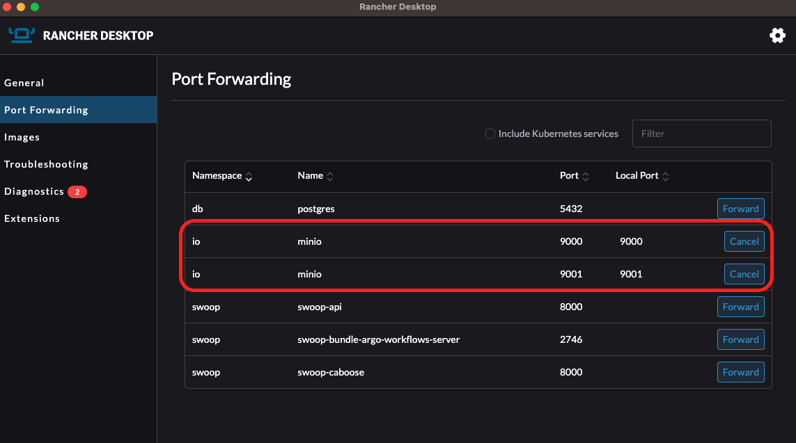
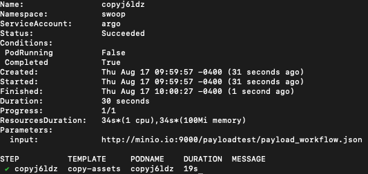
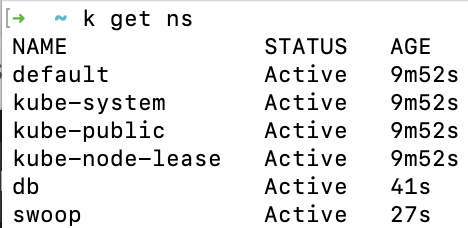
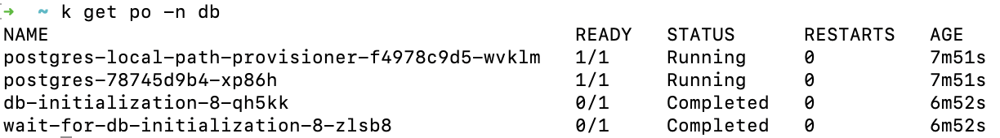
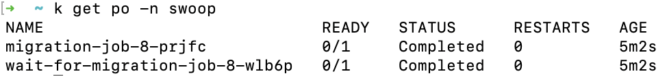
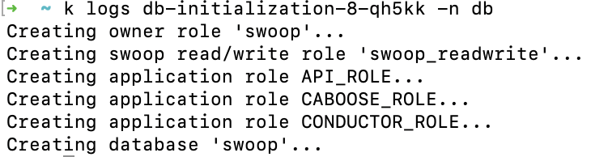
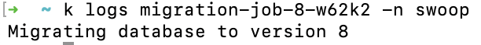
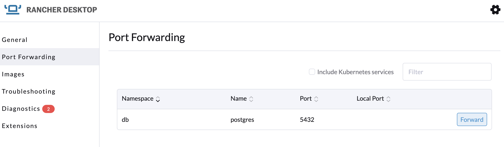
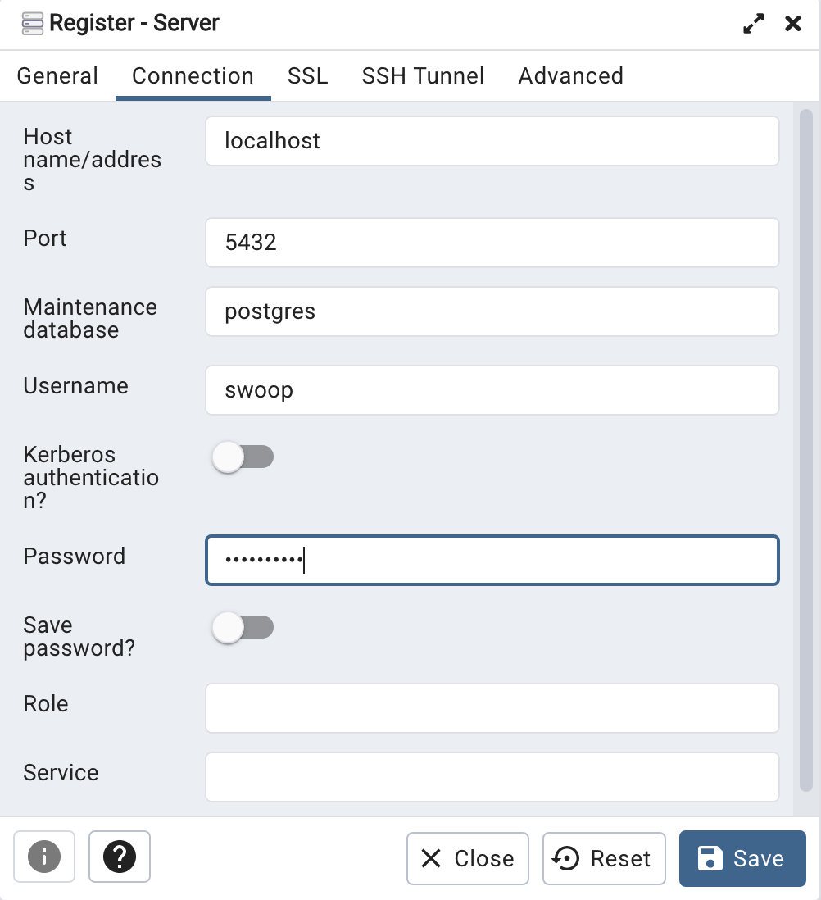
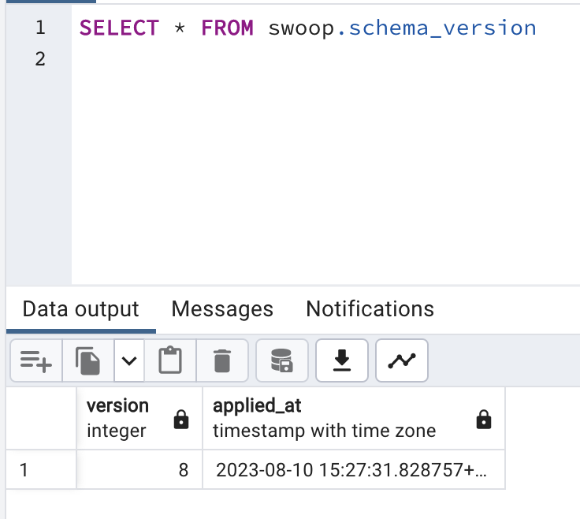

# SWOOP

This module defines the resources required for the SWOOP: STAC Workflow Open Orchestration Platform. This includes:

- [SWOOP API](./swoop-api/README.md): a FastAPI application that acts as an interface for clients to interact with the processing pipeline and state database. The helm chart for the SWOOP API can be found at: [https://github.com/Element84/filmdrop-k8s-helm-charts/](https://github.com/Element84/filmdrop-k8s-helm-charts/)
- [MinIO](../io/minio/README.md): an object storage service for storing artifacts from the [SWOOP API](https://github.com/Element84/swoop). The helm chart for MinIO can be found at: [https://github.com/Element84/filmdrop-k8s-helm-charts/](https://github.com/Element84/filmdrop-k8s-helm-charts/)
- [Postgres](../db/postgres/README.md): a database service to store the state database of [SWOOP API](https://github.com/Element84/swoop). The helm chart for MinIO can be found at: [https://github.com/Element84/filmdrop-k8s-helm-charts/](https://github.com/Element84/filmdrop-k8s-helm-charts/)

## Installation

***Please run the following steps at the top level of the filmdrop-k8s-tf-modules project.***

***For recommended VM settings and other kubernetes guidance, please check the [Operations Guide](../../operations/Operations_Guide.md)***

***The commands below require you to be on top level directory of the filmdrop-k8s-tf-modules project.***

1. First, update [local.tfvars](../../local.tfvars) or create your own .tfvars:

- For enabling swoop-api and it's dependent services you will need to enable at least the following from your tfvars:

```
deploy_swoop_api          = true
deploy_swoop_caboose      = true
deploy_db_migration       = true
deploy_argo_workflows     = true
deploy_postgres           = true
deploy_db_init            = true
deploy_minio              = true
```

- If you would like to automatically expose the swoop-api, minio and postgres ports in your local environment, you can enable an ingress-nginx that has been provided for this purpose. First for enabling the ingress-nginx module, make sure to update [local.tfvars](../../local.tfvars) or your own .tfvars with the following:

```
deploy_ingress_nginx      = true
```

- Lastly, if you do decide to use the ingress-nginx load balancer to expose your application, you can control which local port would you want to forward the service port via the nginx_extra_values variable in the [local.tfvars](../../local.tfvars) or your own .tfvars:

```
nginx_extra_values = {
  "tcp.<LOCAL_MACHINE_PORT>" = "<NAMESPACE>/<SERVICE_NAME>:<SERVICE_PORT>"
}
```

- For swoop-api, minio and postgres, the default nginx_extra_values configuration would look like:

```
nginx_extra_values = {
  "tcp.8000"  = "swoop/swoop-api:8000"
  "tcp.9000"  = "io/minio:9000"
  "tcp.9001"  = "io/minio:9001"
  "tcp.5432"  = "db/postgres:5432"
}
```

2. Next, initialize terraform:

```bash
terraform init
```

3. Validate that the terraform resources are valid. If your terraform is valid the validate command will respond with *"Success! The configuration is valid."*

```bash
terraform validate
```

4. Run a terraform plan. The terraform plan will give you a summary of all the changes terraform will perform prior to deploying any change. You will a need

```bash
terraform plan -var-file=local.tfvars
```

5. Deploy the changes by applying the terraform plan. You will be asked to confirm the changes and must respond with *"yes"*.

```bash
terraform apply -var-file=local.tfvars
```

## Connecting to SWOOP API

### Connecting with Ingress Nginx

If you decided to enable the ingress-nginx module, then you do not need to do anything else to expose your service ports! You should be able to reach out your services via your localhost without the need of port-forwarding. For example:

```
swoop-api:800 -> localhost:8000
minio:9000 -> localhost:9000
minio:9001 -> localhost:9001
postgres:5432 -> localhost:5432
```

### Connecting without Ingress Nginx

Once the chart has been deployed, you should see at least 3 deployments: postgres, minio and swoop-api.
<br></br>
<p align="center">
  
</p>
<br></br>

In order to start using the services used by this helm chart, you will need to port-forward `postgres` onto localhost port `5432`, port-forward `minio` onto localhost ports `9000` & `9001` and port-forward `swoop-api` onto localhost port `8000`.

Via Rancher Desktop:
<br></br>
<p align="center">
  
</p>
<br></br>

or via terminal:

```
kubectl port-forward -n swoop svc/swoop-api 8000:8000 &
kubectl port-forward -n db svc/postgres 5432:5432 &
kubectl port-forward -n io svc/minio 9000:9000 &
kubectl port-forward -n io svc/minio 9001:9001 &
```

You will see now, that if you reach the swoop api [http://localhost:8000/](http://localhost:8000/), you should see a sample response:

```
$ curl http://localhost:8000/

{"title":"Example processing server","description":"Example server implementing the OGC API - Processes 1.0 Standard","links":[{"href":"http://localhost:8000/conformance","rel":"http://www.opengis.net/def/rel/ogc/1.0/conformance","type":"application/json"}]}%
```

<br></br>

## API tests with Database

To test the API endpoints that make use of data in the postgres database, you will need to load data into the postgres state database or use [swoop-db](https://github.com/Element84/swoop-db) to initialize the schema and load test migrations.

If you want database sample data to test the API, run the following swoop-db commands on the postgres pods to apply the migrations and load the fixtures:

```
kubectl exec -it --namespace=db svc/postgres  -- /bin/sh -c "swoop-db up"
kubectl exec -it --namespace=db svc/postgres  -- /bin/sh -c "swoop-db load-fixture base_01"
```

After loading the database, you should be able to see the jobs in the swoop api jobs endpoint [http://localhost:8000/jobs/](http://localhost:8000/jobs/):

```
$ curl http://localhost:8000/jobs/

{"jobs":[{"processID":"action_1","type":"process","jobID":"0187c88d-a9e0-788c-adcb-c0b951f8be91","status":"successful","created":"2023-04-28T15:49:00+00:00","started":"2023-04-28T15:49:02+00:00","finished":"2023-04-28T15:49:03+00:00","updated":"2023-04-28T15:49:03+00:00","links":[{"href":"http://localhost:8000/","rel":"root","type":"application/json"},{"href":"http://localhost:8000/jobs/0187c88d-a9e0-788c-adcb-c0b951f8be91","rel":"self","type":"application/json"},{"href":"http://localhost:8000/jobs/0187c88d-a9e0-788c-adcb-c0b951f8be91/results","rel":"results","type":"application/json"},{"href":"http://localhost:8000/jobs/0187c88d-a9e0-788c-adcb-c0b951f8be91/inputs","rel":"inputs","type":"application/json"},{"href":"http://localhost:8000/processes/action_1","rel":"process","type":"application/json"},{"href":"http://localhost:8000/payloadCacheEntries/ade69fe7-1d7d-572e-9f36-7242cc2aca77","rel":"cache","type":"application/json"}]},{"processID":"action_2","type":"process","jobID":"0187c88d-a9e0-757e-aa36-2fbb6c834cb5","status":"accepted","created":"2023-04-28T15:49:00+00:00","started":null,"finished":null,"updated":"2023-04-28T15:49:00+00:00","links":[{"href":"http://localhost:8000/","rel":"root","type":"application/json"},{"href":"http://localhost:8000/jobs/0187c88d-a9e0-757e-aa36-2fbb6c834cb5","rel":"self","type":"application/json"},{"href":"http://localhost:8000/jobs/0187c88d-a9e0-757e-aa36-2fbb6c834cb5/results","rel":"results","type":"application/json"},{"href":"http://localhost:8000/jobs/0187c88d-a9e0-757e-aa36-2fbb6c834cb5/inputs","rel":"inputs","type":"application/json"},{"href":"http://localhost:8000/processes/action_2","rel":"process","type":"application/json"},{"href":"http://localhost:8000/payloadCacheEntries/ade69fe7-1d7d-572e-9f36-7242cc2aca77","rel":"cache","type":"application/json"}]}],"links":[{"href":"http://localhost:8000/","rel":"root","type":"application/json"},{"href":"http://localhost:8000/jobs/","rel":"self","type":"application/json"}]}%
```

## API tests with Object Storage

In order to load data into MinIO, follow these steps:

### Install First the MinIO client by running

```
brew install minio/stable/mc
```

### Then set the MinIO alias, find the ACCESS_KEY and SECRET_KEY by quering the Helm values

```
export MINIO_ACCESS_KEY=`kubectl get secrets -n io minio-secret-credentials --template={{.data.access_key_id}} | base64 --decode`
export MINIO_SECRET_KEY=`kubectl get secrets -n io minio-secret-credentials --template={{.data.secret_access_key}} | base64 --decode`
mc alias set swoopminio http://127.0.0.1:9000 $MINIO_ACCESS_KEY $MINIO_SECRET_KEY
```

### Test MinIO connection by running

```
$ mc admin info swoopminio

●  127.0.0.1:9000
   Uptime: 23 minutes
   Version: 2023-06-02T23:17:26Z
   Network: 1/1 OK
   Drives: 1/1 OK
   Pool: 1

Pools:
   1st, Erasure sets: 1, Drives per erasure set: 1

0 B Used, 1 Bucket, 0 Objects
1 drive online, 0 drives offline
```

### Load data into MinIO by running

First clone the [https://github.com/Element84/swoop](https://github.com/Element84/swoop) repository locally, and then run the following from the top level of the your local swoop clone:

```
$ mc cp --recursive tests/fixtures/io/base_01/ swoopminio/swoop/execution/2595f2da-81a6-423c-84db-935e6791046e/

...fixtures/io/base_01/output.json: 181 B / 181 B ━━━━━━━━━━━━━━━━━━━━━━━━━━━━━━━━━━━━━━━━ 1.67 KiB/s 0s
```

### View your data on MinIO by opening your browser on [http://localhost:9001/](http://localhost:9001/) and logging into MinIO

Retrieve username by running:

```
helm get values minio -n io -a -o json | jq -r .minio.service.accessKeyId | base64 --decode
```

Retrieve password by running:

```
helm get values minio -n io -a -o json | jq -r .minio.service.secretAccessKey | base64 --decode
```

Open MinIO dashboard by opening your browser on [http://localhost:9001/](http://localhost:9001/) and logging into MinIO using the credentials above:
<p align="center">
  
</p>
<br></br>

### Test API with MinIO by running

```
$ curl http://localhost:8000/jobs/2595f2da-81a6-423c-84db-935e6791046e/inputs

{"process_id":"2595f2da-81a6-423c-84db-935e6791046e","payload":"test_input"}%
```

```
$ curl http://localhost:8000/jobs/2595f2da-81a6-423c-84db-935e6791046e/results

{"process_id":"2595f2da-81a6-423c-84db-935e6791046e","payload":"test_output"}%
```

<br></br>

## Validating SWOOP Caboose installation

Check the logs of the swoop-caboose pod and check your workers have started via:

```
$ kubectl logs -n swoop svc/swoop-caboose

time="2023-07-31T21:26:13Z" level=info msg="index config" indexWorkflowSemaphoreKeys=true
2023/07/31 21:26:13 starting worker 0
2023/07/31 21:26:13 starting worker 1
2023/07/31 21:26:13 starting worker 2
```

<br></br>

## Running an Argo workflow
For full documentation for argo workflows, please visit the [Argo Workflows Official Documentation](https://argoproj.github.io/argo-workflows/).

For a full list of customization values for the argo-workflows helm chart, visit [Argo Workflows ArtifactHub](https://artifacthub.io/packages/helm/argo/argo-workflows).

### Pre-requisites to running Argo Workflows example
You will need an AWS account, with an S3 bucket and an IAM user with read/write access to that bucket.

1. Go to your account in AWS, and create an S3 bucket for your assets, for example:
<br></br>
<p align="center">
  
</p>
<br></br>

2. Create an IAM user with a read/write policy to your bucket.
<br></br>
<p align="center">
  
</p>
<p align="center">
  
</p>
<br></br>

### Installation of Argo Workflows
Argo Workflows have been included as part of the swoop-bundle, as a dependency of swoop-caboose. To deploy argo workflows follow these steps:

***The commands below require you to be on top level directory of the filmdrop-k8s-tf-modules project.***

1. First, update [local.tfvars](../../local.tfvars) or create your own .tfvars:

- For enabling swoop-api and it's dependent services you will need to enable at least the following from your tfvars:

```
deploy_swoop_api          = true
deploy_swoop_caboose      = true
deploy_db_migration       = true
deploy_argo_workflows     = true
deploy_postgres           = true
deploy_db_init            = true
deploy_minio              = true
```

2. Next, initialize terraform:

```bash
terraform init
```

3. Validate that the terraform resources are valid. If your terraform is valid the validate command will respond with *"Success! The configuration is valid."*

```bash
terraform validate
```

4. Run a terraform plan. The terraform plan will give you a summary of all the changes terraform will perform prior to deploying any change. You will a need

```bash
terraform plan -var-file=local.tfvars
```

5. Deploy the changes by applying the terraform plan. You will be asked to confirm the changes and must respond with *"yes"*.

```bash
terraform apply -var-file=local.tfvars
```

### Running Argo Workflows Copy Assets Stac Task
The [copy-assets-stac-task](https://github.com/Element84/copy-assets-stac-task) example will run an argo workflow which copies specified Assets from Source STAC Item(s), uploads them to S3 and updates Item assets hrefs to point to the new location.


Now, prior to running the argo workflows example, first make sure to port-forward `minio` onto localhost ports `9000` & `9001`.

Via Rancher Desktop:
<br></br>
<p align="center">
  
</p>
<br></br>

or via terminal:

```
kubectl port-forward -n io svc/minio 9000:9000 &
kubectl port-forward -n io svc/minio 9001:9001 &
```

#### Install First the MinIO client by running

```
brew install minio/stable/mc
```

#### Then set the MinIO alias, find the ACCESS_KEY and SECRET_KEY by quering the Helm values

```
export MINIO_ACCESS_KEY=`kubectl get secrets -n io minio-secret-credentials --template={{.data.access_key_id}} | base64 --decode`
export MINIO_SECRET_KEY=`kubectl get secrets -n io minio-secret-credentials --template={{.data.secret_access_key}} | base64 --decode`
mc alias set swoopminio http://127.0.0.1:9000 $MINIO_ACCESS_KEY $MINIO_SECRET_KEY
```

####  Run the [copy-assets-stac-task](https://github.com/Element84/copy-assets-stac-task) argo workflow example

First clone the [copy-assets-stac-task](https://github.com/Element84/copy-assets-stac-task) repository.

After cloning the [copy-assets-stac-task](https://github.com/Element84/copy-assets-stac-task) repository, first proceed to modify the `payload_workflow.json` and replace the `<REPLACE_WITH_ASSETS_S3_BUCKET_NAME>` with the bucket name created on the [Pre-requisites section](#pre-requisites-to-running-argo-workflows-example).

Create a public minio local bucket and copy the `payload_workflow.json` file after replacing the `<REPLACE_WITH_ASSETS_S3_BUCKET_NAME>` name. To do this via the minio client:

```
$ mc mb swoopminio/payloadtest

Bucket created successfully `swoopminio/payloadtest`.
```
```
$ mc anonymous set public swoopminio/payloadtest

Access permission for `swoopminio/payloadtest` is set to `public`
```
```
$ mc cp ./payload_workflow.json swoopminio/payloadtest/

...opy-assets-stac-task/payload_workflow.json: 4.58 KiB / 4.58 KiB ━━━━━━━━━━━━━━━━━━━━━━━━━━━━━━━━━━━━━━━━━━━━━━━━━━━━━━━━━━━━━━━━━━━━━━━━━━━━━━━━━━━━━━━━━━━━━━━━━━━━━━━━━━━━━━━━━━━━━━━━━━━━━━━━━━━━━━━━━━━━━━━━━━━━━━━━━━━━━━━━━━━━━━━━━━━━━━━━━ 127.61 KiB/s 0s
```

Now modify the `secrets.yaml` and replace the `<REPLACE_WITH_BASE64_AWS_ACCESS_KEY>`, `<REPLACE_WITH_BASE64_AWS_SECRET_ACCESS_KEY>` and `<REPLACE_WITH_BASE64_AWS_REGION>` with the base64 encoded version of the AWS_ACCESS_KEY, AWS_SECRET_ACCESS_KEY and AWS_REGION of the iam user and bucket created on the [Pre-requisites section](#pre-requisites-to-running-argo-workflows-example).

Create the kubernetes secret by executing:
```
kubectl apply -n swoop -f ./secret.yaml
```

Then modify the `<REPLACE_WITH_MINIO_HOST>:<REPLACE_WITH_MINIO_PORT>` variables inside the `workflow_copyassets_no_template.yaml` and the `workflow_copyassets_with_template.yaml`. If you're running this example from a minio created by the terraform stack, you should be able to replace `<REPLACE_WITH_MINIO_HOST>:<REPLACE_WITH_MINIO_PORT>` with `minio.io:9000`.

Finally, run and watch the argo workflow task via:
```
argo submit -n swoop --watch ./workflow_copyassets_no_template.yaml
```

You should be able to see your workflow pod succeed in the terminal:
<br></br>
<p align="center">
  
</p>
<br></br>

And you should be able to see your asset S3 bucket populated with a tumbnail image:
```
aws s3 ls s3://copy-assets-stac-task-bucket/data/naip/tx_m_2609719_se_14_060_20201217/

2023-08-17 10:00:08       9776 thumbnail.jpg
```

Similarly, you should be able to run the `workflow_copyassets_with_template.yaml` workflow in the [copy-assets-stac-task](https://github.com/Element84/copy-assets-stac-task) repository by following these steps:

1. Create first the workflow template by the following command:
```
kubectl apply -n swoop -f ./workflow-template.yaml
```
2. Submit the argo workflow by:
```
argo submit -n swoop --watch ./workflow_copyassets_with_template.yaml
```

<br></br>


Notes:
* When utilizing the argo workflow installation provided via the swoop-bundle, you should be able to run argo workflows in the following manner:
```
argo submit -n swoop --watch <FULL PATH TO THE SAMPLE WORKFLOW YAML FILE>
```
* The're is a service account created to support the required argo permissions `serviceAccountName: argo`
* You should not expect the argo server, nor archive logs to be functional with the default argo installation. In order to enable those settings please see:
  * [Argo Workflows Official Documentation](https://argoproj.github.io/argo-workflows/)
  * [Argo Workflows ArtifactHub](https://artifacthub.io/packages/helm/argo/argo-workflows)


<br>

## Database Migrations on K8s

The Filmdrop K8s Terraform modules can be used to perform schema migrations on Postgres database pods in K8s.

### Background

In order to apply database migrations in K8s, we first need an existing state database within which to apply migrations. The SWOOP infrastructure contains multiple components - the SWOOP API, Caboose, and Conductor- that also need to access this database with their own roles, each of which have certain privileges to perform actions on the database. To create a database with the appropriate set of roles after which migrations will be applied, two separate jobs have been created - a database initialization job and a database migration job. The purpose of the database initialization job is to create the set of appropriate roles and create a database named `swoop` where migrations will be later applied by the migration job. The initialization job also creates an 'owner' role named `swoop` that will own all of the objects created in the database, along with a 'read/write' role, and application roles for each individual SWOOP component (SWOOP API, SWOOP Caboose, and SWOOP Conductor) to access the database within which migrations will be applied. The application roles are members of the SWOOP read/write role. The initialization job does not create any tables within the `swoop` schema; these are created during the migrations. However, in order for the owner role to own the objects created during the migrations, the initialization job sets the owner role as the owner of the database. After the database is initialized, migrations can be performed; this is the purpose of the migration job, to migrate or rollback the `swoop` database to an appropriate database version. To prevent any issues with any existing active connections from any of the application roles interfering with the migration process, an optional `no_wait` parameter can be specified for the migration job that when set to `false` will wait for all active connections from any of the application roles to first close before applying any migrations. Once the migrations are complete, the `swoop` schema within the `swoop` database will contain all of the tables for the migration version applied, and the `swoop.schema_version` table will show the current migration version of the database and the time at which it was applied. After deploying to K8s, the pod for each SWOOP application component (api, caboose, and conductor) will have an `initContainer` that waits for the migrations to be applied before reaching a completed state, after which the pod gets deployed onto the cluster.

### Deployment

In order to apply migrations via the Terraform modules, three flags need to be enabled at a minimum. The `local.tfvars` file should look like:

```
deploy_linkerd            = false
deploy_ingress_nginx      = false
deploy_grafana_prometheus = false
deploy_loki               = false
deploy_promtail           = false
deploy_argo_workflows     = false
deploy_titiler            = false
deploy_stacfastapi        = false
deploy_swoop_api          = false
deploy_swoop_caboose      = false
deploy_db_migration       = true
deploy_postgres           = true
deploy_db_init            = true
deploy_minio              = false
```

If only database initialiation is desired (with no migrations), then the `deploy_db_migration` flag should be set to false.

```
deploy_linkerd            = false
deploy_ingress_nginx      = false
deploy_grafana_prometheus = false
deploy_loki               = false
deploy_promtail           = false
deploy_argo_workflows     = false
deploy_titiler            = false
deploy_stacfastapi        = false
deploy_swoop_api          = false
deploy_swoop_caboose      = false
deploy_db_migration       = false
deploy_postgres           = true
deploy_db_init            = true
deploy_minio              = false
```

Make sure you have a K8s cluster running and your Kubeconfig file contains the proper credentials to authenticate to that cluster.

Then, do:

1. Initialize Terraform:

```bash
terraform init
```

2. Validate that the Terraform resources are valid. If your Terraform is valid the validate command will respond with *"Success! The configuration is valid."*

```bash
terraform validate
```

3. Run a terraform plan. The terraform plan will give you a summary of all the changes terraform will perform prior to deploying any change.

```bash
terraform plan -var-file=local.tfvars
```

5. Deploy the changes by applying the terraform plan. You will be asked to confirm the changes and must respond with *"yes"*.

```bash
terraform apply -var-file=local.tfvars
```

This will deploy, in order, the postgres database, the database initialization job, and the database migration job (if enabled). These resources will ultimately get deployed through their helm charts, provided in the [filmdrop-k8s-helm-charts](https://github.com/Element84/filmdrop-k8s-helm-charts).

After deploying, you will see a `db` namespace and a `swoop` namespace.

<p align="center">
  
</p>
<br>

The `db` namespace will contain the database initialization pod and the `swoop` namespace will contain the migration job pod.

<p align="center">
  
</p>
<br>

<p align="center">
  
</p>
<br>

The logs from each of these pods should show messages coming from their respective scripts. For example:

<p align="center">
  
</p>
<br>

<p align="center">
  
</p>
<br>

After deploying to K8s, you can port-forward the `postgres` service to a localhost port in Rancher Desktop as follows:

<p align="center">
  
</p>
<br>

and connect to the database with pgAdmin using the `swoop` role:

<p align="center">
  
</p>
<br>

You will see that there is a database named `swoop` containing all tables, and that all roles that were created by the database initialization script appear under Login/Group Roles. All of the objects in the `swoop` schema are owned by the `swoop` role, since that role was used to apply the migrations.

If you open the `swoop.schema_version` table, you wil see a record in the table with the migration version number (8, in this example) and the time at which it was applied:

<p align="center">
  
</p>
<br>

### Customization of deployment

The above procedure will create the database and run the migrations using default values for all parameters. However, the Filmdrop K8s Terraform modules allow you to do a lot of customization for any deployment. Customization is performed through setting variable values in Terraform. Variables have precedence, depending on where they are defined.

Any variable that is assigned a value in `local.tfvars` should be defined within the `inputs.tf` file in the root directory. The variable can have a default value that gets used if one is not explicitly provided in `local.tfvars`; this default value can be specified in `inputs.tf`. This repository is setup using the concept of a profile, a template combining multiple modules that configure an environment stack. A module is a unique collection of resources that get deployed as one unit onto K8s, and this repository contains separate modules for database, I/O, ingress, STAC, etc (see the `modules` directory),. There is only one profile named `core` used in this repo, and the configuration values for variables are passed into the profile via the `local.tf` file, also in the root directory. The core profile, located at `./profiles/core/profile.tf`, deploys all of the individual Terraform modules using the values passed in from `local.tf`. The `--var-file` option in `terraform apply` overrides the value of any variable that is defined within the modules. If a value for a variable has been assigne within `local.tfvars`, that value gets used as the value for that variable, overriding any values defined within the core profile itself or any individual module used by the core profile for that variable. If, however, a variable is not contained within the `local.tfvars` file and/or not passed in to the core profile in `local.tf`, it gets the default value assigned to it in the profile itself at `./profiles/core/profile.tf`.

### Roles and permissions

The database initialization script creates, in order, an owner role (named `swoop`), a SWOOP read/write role (named `swoop_readwrite`), and three application roles (named `swoop_api`, `swoop_caboose`, and `swoop_conductor`) for each of the SWOOP components to access the database. All roles except the SWOOP read/write role are user roles, meaning that they have login privileges into the database as users. The `swoop_readwrite` role is a group role, which contains the three application roles as its members. Being a group role, any privileges assigned to the `swoop_readwrite` role are automatically assigned to its member roles as privileges are inherited by member roles from parent group roles by default in Postgres. The `swoop_readwrite` role, is given connection privileges on the `swoop` database, and has read/write privileges on objects within the schema `swoop`. During the migration job, however, connect privileges from the `swoop_readwrite` role are revoked initially if the `NO_WAIT` environment variable is set to `false`, so that all active connections any of the application roles to the database are closed first before any migrations are applied. Connect privileges are granted back to the `swoop_readwrite` role at the end of the migration job regardless of whether or not the job waited for any active connections from the application roles to close, to maintain a consistent state of the database regardless of whether or not we have waited for active connections to close.

## Uninstall swoop-api

To uninstall the release, do `terraform destroy -var-file=local.tfvars`.
