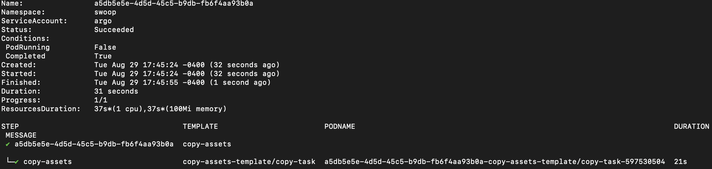

# Workflow configuration resources

This module installs resources that deploy the SWOOP configuration file and workflow template files used by Argo Workflows to run workflows on the cluster.

## Installation

Update the `local.tfvars` file to:

```
deploy_linkerd            = false
deploy_ingress_nginx      = false
deploy_grafana_prometheus = false
deploy_loki               = false
deploy_promtail           = false
deploy_argo_workflows     = true
deploy_titiler            = false
deploy_stacfastapi        = false
deploy_swoop_api          = false
deploy_swoop_caboose      = true
deploy_db_migration       = true
deploy_postgres           = true
deploy_db_init            = true
deploy_minio              = true
deploy_workflow_config    = true

aws_access_key = "<REPLACE_WITH_AWS_ACCESS_KEY>"
aws_secret_access_key = "<REPLACE_WITH_AWS_SECRET_ACCESS_KEY>"
aws_region = "<REPLACE_WITH_AWS_REGION>"
aws_session_token = "<REPLACE_WITH_AWS_SESSION_TOKEN>"
```

1. First, initialize Terraform:

```bash
terraform init
```

2. Validate that the terraform resources are valid. If your Terraform configuration is valid the validate command will respond with _"Success! The configuration is valid."_

```bash
terraform validate
```

3. Run terraform plan. The terraform plan will give you a summary of all the changes Terraform will perform prior to deploying any change.

```bash
terraform plan
```

4. Deploy the changes by applying terraform plan. You will be asked to confirm the changes and must respond with _"yes"_.

```bash
terraform apply --var-file=local.tfvars
```

Once the chart has been deployed, you can do:

`kubectl get workflowtemplate -n swoop` and

`kubectl get configmap -n swoop`

to see that the workflow templates and SWOOP configmap that were deployed.

## Running the mirror workflow

Create a bucket in S3 that will be used to hold your output assets from the workflow. Create an IAM user that has read/write permissions to this bucket and generate a set of AWS credentials (Access Key ID and Secret Access Key) for this user. These AWS credentials should have permissions to write to an S3 bucket where the output assets from the workflow will be uploaded.

Create an `input.json` file for the input payload or clone the [copy-assets-stac-task](https://github.com/Element84/copy-assets-stac-task) repo and use the payload_workflow.json as reference.

Modify the `process/upload_options/path_template`property of the input payload to contain the bucket name of the S3 bucket created in the previous step. For example, if the bucket is named `mirrorworkflowoutput`, the `path_template` should be:

`"path_template": "s3://mirrorworkflowoutput/data/${collection}/${id}/"`

This is a sample UUID used for this example. Enter this in the command line.
`export UUID=a5db5e5e-4d5d-45c5-b9db-fb6f4aa93b0a`

Upload the `input.json` file to a MinIo bucket. Replace the <PATH_TO_INPUT.JSON> with the path to your `input.json` file.

```
kubectl port-forward -n io svc/minio 9000:9000 &
export MINIO_ACCESS_KEY=`kubectl get secrets -n io minio-secret-credentials --template={{.data.access_key_id}} | base64 --decode`
export MINIO_SECRET_KEY=`kubectl get secrets -n io minio-secret-credentials --template={{.data.secret_access_key}} | base64 --decode`
mc alias set swoopminio http://127.0.0.1:9000 $MINIO_ACCESS_KEY $MINIO_SECRET_KEY
mc cp  <PATH_TO_INPUT.JSON> swoopminio/swoop/executions/${UUID}/input.json
```

To submit the mirror workflow, run:

`argo submit -n swoop --watch --from workflowtemplate/mirror-workflow --name $UUID`

The workflow will run to completion and you will see that is has successfully run in the console. You can also see the output item asset in the S3 bucket.

<br></br>
<p align="center">
  
</p>
<br></br>

## Uninstall workflow-config

To uninstall the release, do `terraform destroy -var-file=local.tfvars`.
