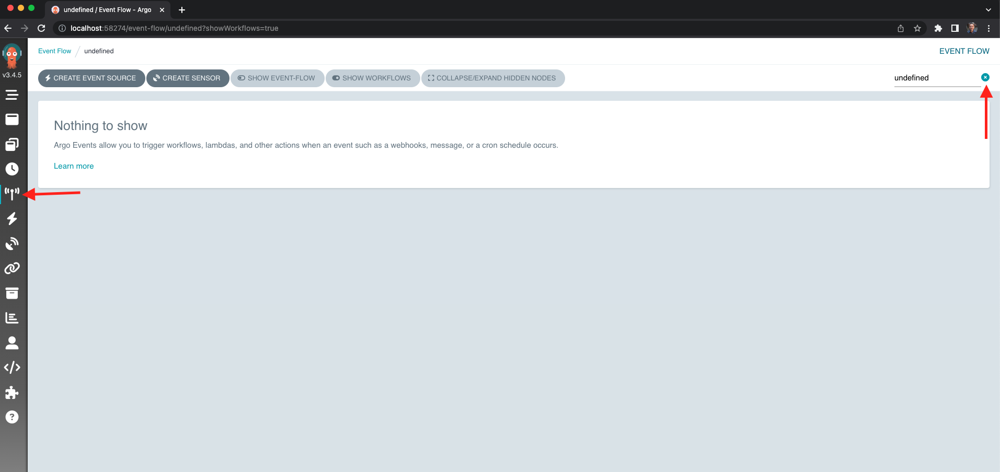
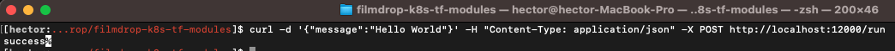
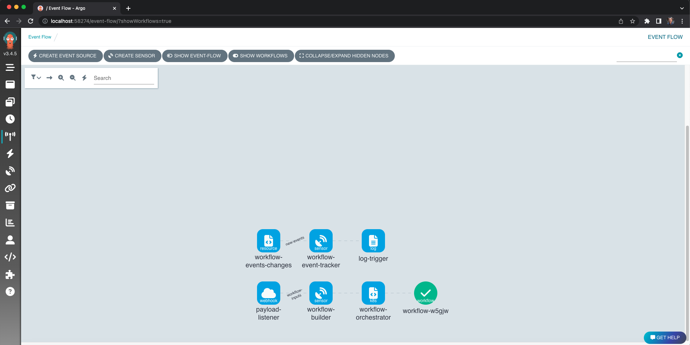
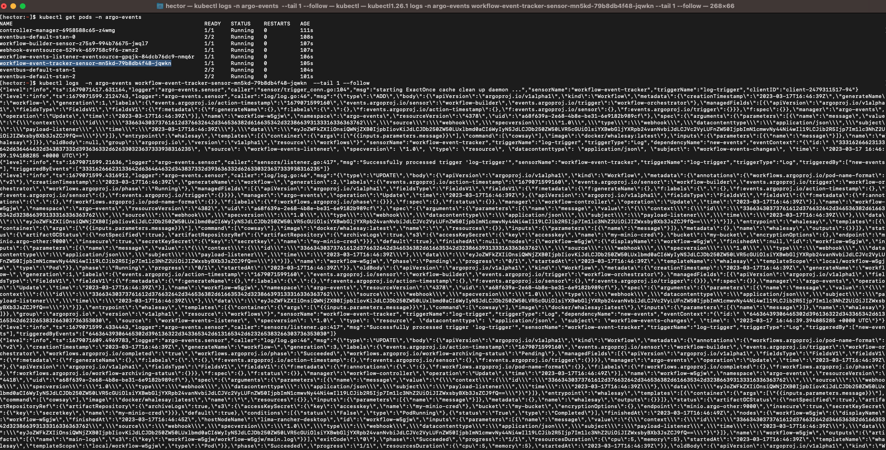

# Workflow Orchestration with Argo Events

In this section we want to provide a guide of how to run the Workflow Operations demo with Argo Events.

Start by running a terraform init, plan and apply with your local or remote tfvars
```
terraform init -upgrade
```
```
terraform plan -var-file=local.tfvars
```
```
terraform apply -var-file=local.tfvars
```

After the terraform apply succeeds proceed to perform a port forwarding for the webhook-eventsource-svc and the argo-workflows-server.


Log into the Argo Workflow Server, by accessing `http://localhost:<ARGO_WORKFLOW_SERVER_PORT>` and head to the Event Flow panel, uncheck the `undefined` namespace, and you should see two Argo Events Pipelines (you may need to scroll down).




Open a terminal window, find the workflow-event-tracker-sensor pod name and tail the logs of that pod. The pod will log all workflow events happening on the same namespace.


Open a separate terminal window, and call the run workflow webhook to start a new workflow.



If you head back to the Argo Workflow Server Event Flow page `http://localhost:<ARGO_WORKFLOW_SERVER_PORT>/event-flow/?showWorkflows=true` you should see a new workflow running and eventually succeeding.



Finally, if you look back at the terminal that you used to tail the logs of the workflow-event-tracker-sensor you should see all the events of the workflow that just ran.



## Installation

1. First, initialize terraform:

```bash
terraform init
```

2. Validate that the terraform resources are valid. If your terraform is valid the validate command will respond with _"Success! The configuration is valid."_

```bash
terraform validate
```

3. Run a terraform plan. The terraform plan will give you a summary of all the changes terraform will perform prior to deploying any change.

```bash
terraform plan
```

4. Deploy the changes by applying the terraform plan. You will be asked to confirm the changes and must respond with _"yes"_.

```bash
terraform apply
```
