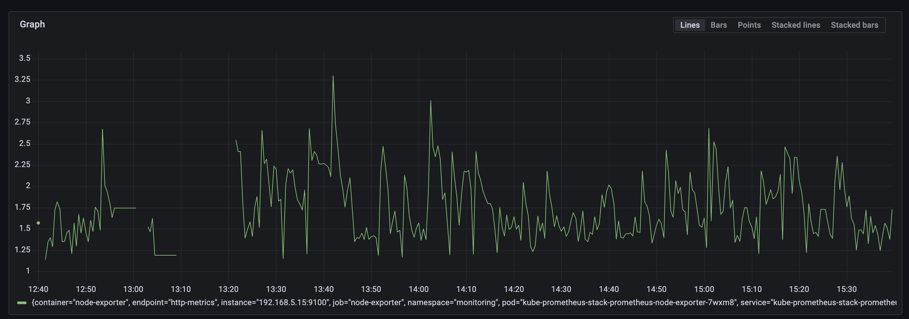
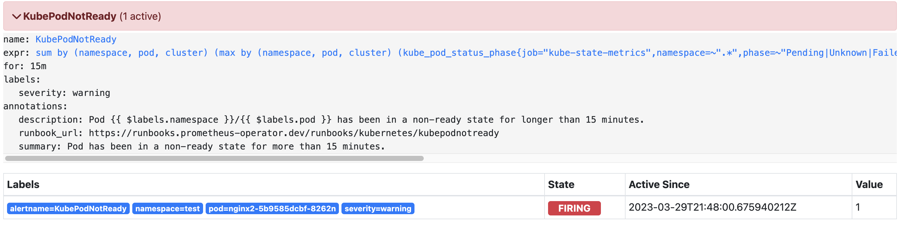
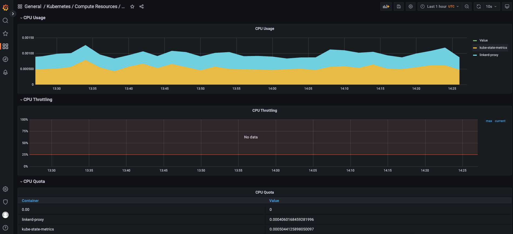

# Operations/Monitoring Runbook

This document summarizes some of the most common problems found during the installation/deployment/operations of the FilmDrop K8s Terraform Modules repository onto a Kubernetes cluster and steps for diagnosing them.

## Pre-requisites

Ensure that you follow all the directions in the Readme file to deploy the FilmDrop K8s Terraform Modules onto a Kubernetes cluster, whether one running locally or on EKS.

Open the Prometheus dashboard by port-forwarding the `kube-prometheus-stack-prometheus` service onto a localhost port (say, 9090).

Open the Grafana dashboard by port-forwarding the `kube-prometheus-stack-grafana` service onto a localhost port (say, 8080).

Grafana will automatically have Prometheus and Loki configured as data sources to monitor, so there is no additional configuration needed here.

Note: Prometheus is automatically configured as the **default** data source. Therefore, if you want to see any metrics on any dashboard that use Loki as the data source, you will explicitly have to select Loki as the data source (if it is available) from the 'datasource' drop-down at the top of the dashboard.

## Grafana dashboards

Click on the 'Dashboards' icon (the four-squares) on the left-side menu. This will present a list of pre-configured dashboards. Each dashboard is composed of multiple panels, and each panel showcases one or more metrics that provide observability into the functioning of the K8s cluster.

For all dashboards, you can select the temporal range to display on the charts and the auto-refresh interval by choosing the appropriate values in the header panel at the top.

Many of these dashboards showcase the exact same information, albeit in different ways, such as aggregation at coarser or finer levels such as namespace, deployment, or pod.

The most important dashboards for observability/monitoring of the K8s cluster are:

* **Kubernetes / API Server**: This shows metrics about general availability of the K8s cluster, memory, CPU usage, service level indicators (SLI's), and error budget. This dashboard operates at the cluster level.
* **Kubernetes / Compute Resources / Cluster**: This dashboard gives a good overview at a **cluster-level** of the CPU, memory, and network metrics of the cluster. However, it also provides an even-finer breakdown of the metrics at a **namespace** level within the cluster. The CPU panel shows you the CPU usage for each namespace. The CPU Quota panel shows CPU usage, requests, and limits for each namespace, and also a count of the total number of pods running and workloads (i.e. deployments, statefulsets, daemonsets, or jobs) running within each namespace. Similarly, the Memory and Memory Requests panels display the same kinds of metrics, just for memory usage by namespace.
* **Kubernetes / Compute Resources / Namespace (Pods)**: This dashboard is very similar to the 'Kubernetes/Compute Resources/Cluster' dashboard, except that it can provide metrics at an even-finer level - that of a *pod*. By choosing a namespace at the top, the dashboard can show you the CPU and memory requests and limits that each pod within that namespace is making. This can help you to troubleshoot pods that, for example, are requesting an exceptionally high level of CPU cores.
* **Kubernetes / Compute Resources / Namespace (Workloads)**: This dashboard allows you to see the CPU, memory, and network resource requests and limits for Kubernetes workloads- such as deployments, statefulsets, and daemonsets. This is the exact same set of metrics as the Kubernetes / Compute Resources / Namespace (Pods) dashboard, but displayed at a *namespace-workload* (and not pod) level. That is, the metric is aggregated to the namespace level, with a depiction of the resources consumed by each workload within that namespace.
* **Kubernetes / Compute Resources / Node (Pods)**: for a multi-node cluster, this dashboard is useful for trying to isolate any problems to a particular *node* within the cluster, by choosing the node from the node drop-down at the top. Apart from that, this dashboard gives the same panels as the cluster and namespace dashboards listed above. Therefore, the only difference is that this provides monitoring at a node level.
* **Kubernetes / Compute Resources / Pod**: The added advantage of this dashboard is that it shows you CPU and memory consumed by each *container* within a pod. Each pod can contain multiple containers, so it is useful to know how each container is functioning for troubleshooting resource problems with any single container.
* **Kubernetes / Compute Resources / Workload**: This shows metrics for each individual *workload* within the cluster. Select a namespace and a workload, and the panels will show metrics for all pods that correspond to that workload.
* **Node Exporter / Nodes**: this provides a clear graphical depiction of the history of CPU usage, memory usage, load, disk I/O, and disk space usage for the nodes that compose your K8s cluster. You can select the specific node from the drop-down at the top, and the dashboard will then update with metrics pertaining to that node. These metrics are coming from the node-exporter process running within Prometheus that captures all the host- system-related metrics.


The following table summarizes these dashboards and their metric aggregation levels:

| Dashboard                                 | Agg. Level         |
| ----------------------------------------- | ------------------ |
| API Server                                | Cluster            |
| Compute Resources/Cluster                 | Namespace          |
| Compute Resources/Namespace (Pods)        | Pod                |
| Compute Resources/Namespace (Workloads)   | Workload           |
| Compute Resources/Node (Pods)             | Node               |
| Compute Resources/Pod                     | Container          |
| Compute Resources/Workload                | Workload           |
| Node Exporter/Nodes                       | Node               |


Several of these dashboards are linked to one-another. The only major difference between them is their level of aggregation for summarizing metrics; the actual metrics reported by them are the same. Therefore, clicking on the links in the panels within a dashboard can bring you to another dashboard operating at a finer abstraction level which shows more detail.

## Exploring Prometheus metrics in Grafana

Prometheus stores all metrics data as time series, i.e metrics information is stored along with the timestamp at which it was recorded, and optional key-value pairs called as labels can also be stored along with metrics. These labels add additional dimensions to the time series on which it can be queried.

Click on the 'Explore' icon on the left-side menu, and then choose 'Prometheus' as the data source.

Select a Prometheus metric from the 'Metric' drop-down list and optionally add label filters to restrict the time series output to only those series that match those label filters. Then, click 'Run Query' at the top-right.

Prometheus metrics are useful for troubleshooting a variety of issues.


## Troubleshooting

This section provides resolution steps for common problems reported with these modules.

kube-state-metrics: collects cluster-level metrics (pods, deployments)

node-exporter: runs on all nodes for host-related metrics (cpu, memory, network)


### Plotting the amount (or %) of free memory on a node across time

If you wanted to plot the total percentage of free memory on a node in the K8s cluster, you can build a time series using two pre-existing metrics provided by Prometheus to create a new metric for the total percentage of free memory:

```
100 * (node_memory_MemFree_bytes / node_memory_MemTotal_bytes)
```

*node_memory_MemFree_bytes* is the total amount of free memory left on the node, not including caches or buffers that can be cleared, whereas *node_memory_MemTotal_bytes* is the total amount of memory allocated to the node as a whole. Taking the ratio of these two metrics and multiplying by 100 will give us the total percentage of free memory on the server.

If you enter this expression into the 'Metric' field and click 'Run Query', you will see a graph depicting the values of this time series plotted over the chosen time range.



NOTE: You can also build this expression in the Prometheus server UI running at `http://localhost:9090/graph` by copying/pasting this string into the 'Expression' field and clicking 'Execute'. Switching to the Graph view helps in visualizing the results.

## ImagePullBackOff

If you happen to start a pod with an image but the pod cannot pull the image from the associated image repository, the pod will move into an 'ImagePullBackOff' state. In this case, none of the Grafana dashboards would show any CPU or memory information for that pod- it will be empty- since the pod isn't in a running state and the image cannot be pulled in order to create the pod successfully.

Prometheus will also automatically fire a 'KubePodNotReady' alert alerting you that a pod has entered into that state. It will also provide the name and namespace of the affected pod. See the picture below.




### CrashLoopBackOff

A pod can fail due to various reasons. Sometimes, a pod can also enter into a *CrashLoopBackOff* state in which a container in the pod is started, but crashes and is then restarted, multiple times with an exponentially increasing lag between the restarts. CrashLoopBackOff can occur due to multiple reasons, such as the lack of permissions to read/write from a specific file or folder, or running into a failure during LivenessProbe or ReadinessProbe. This error occurs during runtime. The logs of a pod can help with debugging this very common error.

To view the logs of each pod running within the cluster, click on the 'Explore' icon on the left-side menu. Choose 'Loki' as the data source, and construct an appropriate label filter. Choose 'pod', and then choose the name of the pod from the drop-down list at the right. You can enter a log message such as 'Error' in the 'Line contains' textbox to only show the log messages containing the string 'Error'. Then, click 'Run Query' at the top right. This will populate the Logs panel with the list of log messages for that specific pod. These log messages are helpful to diagnose common errors that can occur that can cause pods to transition to a CrashLoopBackOff state, or have trouble acquiring the resources they need to enter into a successful running state. These are the exact same log messages that you can also retrieve using the command-line `kubectl logs <POD_NAME>` command.

### Memory or CPU issues


To quickly get an idea of what resources (CPU, memory) each pod in a namespace is requesting/consuming, you can head over to the *Kubernetes - Compute Resources - Namespace (Pods)* or *Kubernetes - Compute Resources - Pod* dashboards to see the CPU Usage, CPU Requests, CPU Limits, Memory Requests, and Memory Limits associated with each pod in a namespace or, even better, each container within each pod in that namespace.

To monitor the overall CPU and Memory consumption of your cluster, navigate to the *Kubernetes - Compute Resources - Cluster* dashboard, where you can see a detailed breakdown of which namespaces are currently using the most CPU, memory, or network bandwidth.

If a certain namespace is consuming a lot of CPU or memory, this can help you to identify that namespace. You can then click on the namespace name in the 'CPU Quota', 'Memory Requests', or 'Current Network Usage' panels. This will bring you to the *Kubernetes - Compute Resources - Namespace (Pods)* dashboard, whichshows a breakdown of the CPU, Memory, and Network usages across the pods within that namespace. Furthermore, clicking on a specific pod within this dashboard will bring you to the *Kubernetes - Compute Resources - Pod* dashboard, which will show a breakdown of the resource consumption for each container within that pod.



In this way, you can isolate your resource problem by starting out at the cluster level and drilling down to the namespace, pod, and container levels. You can then delete the faulty pod(s) using a `kubectl delete` command.


### Creating Alerts with Prometheus AlertManager


TODO