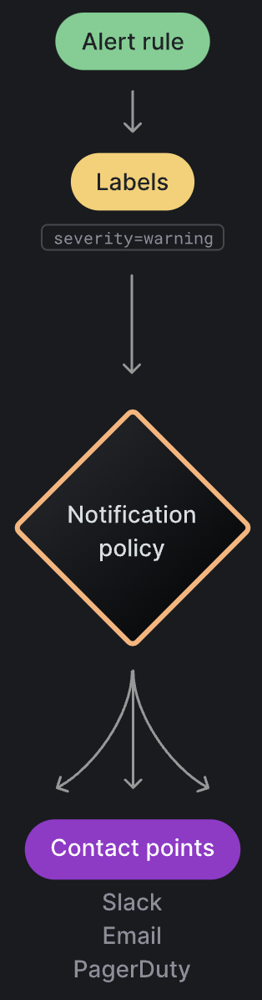

# Operations/Monitoring Runbook

This document summarizes some of the most common problems found during the installation/deployment/operations of the FilmDrop K8s Terraform Modules repository onto a Kubernetes cluster and steps for diagnosing them.

## Pre-requisites

### AWS Pre-Requisites

1) You will need to first set up your AWS CLI credentials, and there are different options like a credentials file or environment variables. Head to the [AWS Documentation](https://docs.aws.amazon.com/cli/latest/userguide/cli-chap-configure.html) for more info.

2) Go through the AWS Documentation to set up your Kube Config file with EKS: https://docs.aws.amazon.com/eks/latest/userguide/create-kubeconfig.html

3) To create a new kube config file with EKS kubernetes credentials for your CICD system, follow the steps below: 
#### Adding the EKS Kubernetes credentials to a new kube config file
To add the EKS Kubernetes credentials to a new kube config file, run the following commands:

```export region_code=<AWS_REGION>```  <br />
```export cluster_name=<EKS_CLUSTER_NAME>```  <br />
```export account_id=<AWS_ACCOUNT_ID>```  <br />
```export eks_aws_profile=<AWS_PROFILE>```  <br />
```export aws_kube_config=<NEW_AWS_KUBECONFIG_PATH>```  <br />

Replace the <AWS_REGION> for the AWS region code, <EKS_CLUSTER_NAME> for your EKS Cluster Name, the <AWS_ACCOUNT_ID> for the AWS Account number.

Replace <AWS_PROFILE> by your AWS profile with credentials to access your AWS account, typically found in the credentials file (located at ```~/.aws/credentials```).

Replace <NEW_AWS_KUBECONFIG_PATH> for a new kubeconfig file path, for example: ```~/.kube/awsconfig```

Rertrieve the cluster endpoint:
```
export cluster_endpoint=$(aws eks describe-cluster \
    --region $region_code \
    --name $cluster_name \
    --query "cluster.endpoint" \
    --output text)
```

Rertrieve the certificate:
```
export certificate_data=$(aws eks describe-cluster \
    --region $region_code \
    --name $cluster_name \
    --query "cluster.certificateAuthority.data" \
    --output text)
```

From the this repository top level directory run:
```
./createAWSKubeConfig.sh
```
Go through the AWS Documentation to set up your Kube Config file with EKS: https://docs.aws.amazon.com/eks/latest/userguide/create-kubeconfig.html
```aws eks wait cluster-active --name '<EKS_CLUSTER_NAME>' --profile '<AWS_PROFILE_NAME>' --region=<AWS_REGION>```  <br />
```aws eks update-kubeconfig --name '<EKS_CLUSTER_NAME>' --profile '<AWS_PROFILE_NAME>' --region=<AWS_REGION>```  <br />


Replace the <EKS_CLUSTER_NAME> for your EKS Cluster Name, the <EKS_CLUSTER_ARN> for the EKS Cluster ARN.

Then modify your local terraform variables to reflect the eks context, i.e. set `kubernetes_config_context = "<EKS_CLUSTER_ARN>"` and replace <EKS_CLUSTER_ARN> for the EKS Cluster ARN.

#### Removing the EKS Kubernetes credentials of your kube config file

To add the EKS Kubernetes credentials to your kube config file, run the following commands:

```kubectl config delete-cluster <EKS_CLUSTER_ARN>```  <br />
```kubectl config delete-context <EKS_CLUSTER_ARN>```  <br />
```kubectl config delete-user <EKS_CLUSTER_ARN>```  <br />

Replace the <EKS_CLUSTER_ARN> for the EKS Cluster ARN.

#### Viewing the Linkerd Dashboard with EKS

After the cluster and all components are deployed, in order to view the Linkerd Dashboard:

1) Install the Linkerd CLI onto your local machine using ```curl --proto '=https' --tlsv1.2 -sSfL https://run.linkerd.io/install | sh```

2) Run a ```linkerd check``` to ensure that everything is running correctly. If the check for ```cluster networks contains all pods``` fails, it will tell you which of the pods are not getting discovered by the service mesh along with their IP addresses. In order to view the Dashboard, you need to update the default value for the ```clusterNetworks``` variable in the ```eks/cluster-setup/services.tf``` file to include the IP address of these pods. For example, if one of the pods at IP address ```13.0.1.236``` is unreachable, you need to append this to the end of the variable's default value list like this:

```linkerd_additional_configuration_values = ["clusterNetworks: 10.0.0.0/8,100.64.0.0/10,172.16.0.0/12,192.168.0.0/16,13.0.1.236/24"]```

4) Modify your local terraform variables to reflect the eks context, i.e. set `kubernetes_config_context = "<EKS_CLUSTER_ARN>"` and replace <EKS_CLUSTER_ARN> for the EKS Cluster ARN.

5) Run a terraform apply with `terraform apply -var-file=local.tfvars` or replace the local.tfvars for the file that contains the updated `linkerd_additional_configuration_values` and `kubernetes_config_context` values.

6) Run a ```linkerd check``` again to ensure that the check for ```cluster networks contains all pods``` succeeds.

7) Run ```linkerd viz dashboard &```. This will automatically open up the Linkerd Dashboard on a new tab in your browser at a localhost port. This process can take up to 30 seconds.

### Local Environment Pre-Requisites

Before starting local development, you will need to install the following packages:
* terraform >= 1 (Recommed using latest version 1.3.9)
* Kubernetes Development Tools (kubectl) and a Kubernetes Engine (Rancher Desktop, Docker Desktop, Colima, Kind, etc)
* Linkerd CLI

The easiest way to install Terraform on Mac is to use Homebrew and tfenv. TF Env is a version
manager for terraform. To inistall latest terraform via tfenv in a Mac and Homebrew, run
the following commands:
```
brew install tfenv
tfenv install latest
tfenv use latest
```

Refer to [tfenv](https://github.com/tfutils/tfenv) official documentation for more details.

Also, check the [Terraform Registry](https://registry.terraform.io/) for more Terraform guidelines about how to use terraform.

Linkerd is the Service Mesh of choice for the Local Kubernetes Development environment.

To install the Linkerd CLI manually, run:

```
curl --proto '=https' --tlsv1.2 -sSfL https://run.linkerd.io/install | sh
```

Do not run the additional steps that the Linkerd installation will suggest. Refer to [Linkerd](https://linkerd.io/2.12/overview/) official documentation for more details.
<br><br>

### Starting your local development environment

### Run a local kubernetes cluster
First make sure that your local Kubernetes cluster is running, if you need help creating your local
Kubernetes cluster, check your Kubernetes Engine official documentation.

If you use rancher-desktop or other k3s, make sure you have disabled the traefik ingress. For rancher-desktop,
this can be disabled under the kubernetes settings. The result of enabling traefik will be a conflict with the
nginx ingress controller, thus the ingress-nginx controller pods won't be able to start.

<p align="center">
  
</p>
<br>

### Recommended VM Settings

When testing locally it's advised to use a virtual machine with at least 4 CPUs and 6 GB of memory (RAM). Also, make sure that your MacOS is updated to the latest version (i.e. perform all software updates related to the OS). This can resolve some issues with deployment that arise due to the VM that runs the Kubernetes cluster running out of memory as the Terraform modules are deployed.

In rancher-desktop you can change this setting under Preferences -> Virtual Machine.

<p align="center">
  
</p>
<br>

### Modify the [local.tfvars](./local.tfvars)
Every customization input for your local environment will go in the [local.tfvars](./local.tfvars) file.

Within the [local.tfvars](./local.tfvars) file, it is important that you define the following kuberenetes parameters:
```
kubernetes_config_file = "~/.kube/config"
kubernetes_config_context = "rancher-desktop"
```

The `kubernetes_config_file` should point to the path of your kubernetes config file, while the `kubernetes_config_context` should identify your kubernetes context
depending on your Kubernetes Engine. For example, Rancher Desktop will likely use `kubernetes_config_context = "rancher-desktop"` while Docker Desktop will use `kubernetes_config_context = "docker-desktop"`.

### Start your environment via Terraform
1. First step is to initialize terraform via:
```
terraform init
```

The terraform init should pull the providers needed to run your terraform code.

2. Validate your terraform code with:
```
terraform validate
```

If your terraform is valid, the validate command will respond with `Success! The configuration is valid.`

3. Run a terraform plan
```
terraform plan -var-file=local.tfvars
```

The terraform plan will give you a summary of all the changes terraform will perform prior to deploying
any change.

4.  Run terraform apply
```
terraform apply -var-file=local.tfvars
```

The terraform apply will deploy the changes, but before doing so, terraform will perform an additional plan
and ask you for a confirmation, for wich you need to answer `yes` to proceed with the deployment.

```
Do you want to perform these actions?
  Terraform will perform the actions described above.
  Only 'yes' will be accepted to approve.

Enter a value: yes
```

The deployment will take 5-10 minutes to complete, and if it succeeds, your local environment should be up!
<br><br>

## Monitoring Pre-Requisites

Ensure that you follow all the directions in the Readme file to deploy the FilmDrop K8s Terraform Modules onto a Kubernetes cluster, whether one running locally or on EKS.

Open the Prometheus server UI dashboard by port-forwarding the `kube-prometheus-stack-prometheus` service onto a localhost port (say, 9090).

Open the Grafana dashboard by port-forwarding the `kube-prometheus-stack-grafana` service onto a localhost port (say, 8080).

Grafana will automatically have Prometheus and Loki configured as data sources to monitor, so there is no additional configuration needed here.

**Note**: Prometheus is automatically configured as the **default** data source. Therefore, if you want to see any metrics on any dashboard that use Loki as the data source, you will explicitly have to select Loki as the data source (if it is available) from the 'datasource' drop-down at the top of the dashboard.

### Prometheus, Grafana, and Loki

**Prometheus** is a time series database that runs atop a Kubernetes cluster and provides metrics and alerting for processes and events occuring in the cluster.

**Loki** is a datastore optimized for efficiently holding log data. The efficient indexing of log data distinguishes Loki from other logging systems. Unlike other logging systems, a Loki index is built from labels, leaving the original log message unindexed- this is similar to Prometheus, which also uses labels to query time series metric data.

**Grafana** is the front-end application used to visualize the data collected by Prometheus and Loki (in addition to any other data sources that are configured). Grafana provides a web interface with rich functionality for monitoring and alerting through the use of dashboards and alerting rules. The Grafana deployment here has been configured to automatically add the Prometheus and Loki deployments as data sources so there is no further configuration needed there.


### Grafana dashboards

Click on the 'Dashboards' icon (the four-squares) on the left-side menu. This will present a list of pre-configured dashboards. Each dashboard is composed of multiple panels, and each panel showcases one or more metrics that provide observability into the functioning of the K8s cluster.

For all dashboards, you can select the temporal range to display on the charts and the auto-refresh interval by choosing the appropriate values in the header panel at the top.

Many of these dashboards showcase the exact same information, albeit in different ways, such as aggregation at coarser or finer levels such as namespace, deployment, or pod.

The most important dashboards for observability/monitoring of the K8s cluster are:

* **Kubernetes / API Server**: This shows metrics about general availability of the K8s cluster, memory, CPU usage, service level indicators (SLI's), and error budget. This dashboard operates at the cluster level.
* **Kubernetes / Compute Resources / Cluster**: This dashboard gives a good overview at a **cluster-level** of the CPU, memory, and network metrics of the cluster. However, it also provides an even-finer breakdown of the metrics at a **namespace** level within the cluster. The CPU panel shows you the CPU usage for each namespace. The CPU Quota panel shows CPU usage, requests, and limits for each namespace, and also a count of the total number of pods running and workloads (i.e. deployments, statefulsets, daemonsets, or jobs) running within each namespace. Similarly, the Memory and Memory Requests panels display the same kinds of metrics, just for memory usage by namespace.
* **Kubernetes / Compute Resources / Namespace (Pods)**: This dashboard is very similar to the 'Kubernetes/Compute Resources/Cluster' dashboard, except that it can provide metrics at an even-finer level - that of a *pod*. By choosing a namespace at the top, the dashboard can show you the CPU and memory requests and limits that each pod within that namespace is making. This can help you to troubleshoot pods that, for example, are requesting an exceptionally high level of CPU cores.
* **Kubernetes / Compute Resources / Namespace (Workloads)**: This dashboard allows you to see the CPU, memory, and network resource requests and limits for Kubernetes workloads- such as deployments, statefulsets, and daemonsets. This is the exact same set of metrics as the Kubernetes / Compute Resources / Namespace (Pods) dashboard, but displayed at a *namespace-workload* (and not pod) level. That is, the metric is aggregated to the namespace level, with a depiction of the resources consumed by each workload within that namespace.
* **Kubernetes / Compute Resources / Node (Pods)**: for a multi-node cluster, this dashboard is useful for trying to isolate any problems to a particular *node* within the cluster, by choosing the node from the node drop-down at the top. Apart from that, this dashboard gives the same panels as the cluster and namespace dashboards listed above. Therefore, the only difference is that this provides monitoring at a node level.
* **Kubernetes / Compute Resources / Pod**: The added advantage of this dashboard is that it shows you CPU and memory consumed by each *container* within a pod. Each pod can contain multiple containers, so it is useful to know how each container is functioning for troubleshooting resource problems with any single container.
* **Kubernetes / Compute Resources / Workload**: This shows metrics for each individual *workload* within the cluster. Select a namespace and a workload, and the panels will show metrics for all pods that correspond to that workload.
* **Node Exporter / Nodes**: this provides a clear graphical depiction of the history of CPU usage, memory usage, load, disk I/O, and disk space usage for the nodes that compose your K8s cluster. You can select the specific node from the drop-down at the top, and the dashboard will then update with metrics pertaining to that node. These metrics are coming from the node-exporter process running within Prometheus that captures all the host- system-related metrics.


The following table summarizes these dashboards and their metric aggregation levels:

| Dashboard | Aggregation Level |
| --- | --- |
| API Server | Cluster |
| Compute Resources/Cluster | Namespace |
| Compute Resources/Namespace (Pods)  | Pod |
| Compute Resources/Namespace (Workloads)  | Workload |
| Compute Resources/Node (Pods) | Node |
| Compute Resources/Pod | Container |
| Compute Resources/Workload | Workload |
| Node Exporter/Nodes | Node |


Several of these dashboards are linked to one-another. The only major difference between them is their level of aggregation for summarizing metrics; the actual metrics reported by them are in most cases the same. Therefore, clicking on the links in the panels within a dashboard can bring you to another dashboard operating at a finer or coarser abstraction level, respectively.


## Troubleshooting

This section provides resolution steps for common problems reported with these modules.

There are two main processes operating within Prometheus that are collecting metrics.

**kube-state-metrics**: collects object-level metrics (pods, deployments). It is not focused on the health of the health of the various Kubernetes objects inside your cluster, such as deployments, nodes and pods.

**node-exporter**: runs on all nodes for host-related metrics (cpu, memory, network). This service is needed to get details about the nodes running in your cluster and is deployed as a DaemonSet on all nodes.


### Exploring Prometheus metrics in Grafana

Prometheus stores all metrics data as time series, i.e metrics information is stored along with the timestamp at which it was recorded, and optional key-value pairs called as labels can also be stored along with metrics. These labels add additional dimensions to the time series on which it can be queried.

Click on the 'Explore' icon on the left-side menu, and then choose 'Prometheus' as the data source.

Select a Prometheus metric from the 'Metric' drop-down list and optionally add label filters to restrict the time series output to only those series that match those label filters. Then, click 'Run Query' at the top-right.

Prometheus metrics are useful for troubleshooting a variety of issues.

### Prometheus Server UI

The Prometheus Server UI (obtained by port-forwarding the `kube-prometheus-stack-prometheus` service onto a `localhost` port) provides a lot of useful information. The 'Alerts' tab provides the current state of any alerts that are in inactive, pending, or firing states on the cluster. This is a single place where you can view all of the issues with your cluster. The most important alerts here are those in a 'firing' (color-coded red) or 'pending' (color-coded yellow) state. A variety of alerts have already been pre-configured for monitoring your cluster as a part of the kube-prometheus stack. A list of all of these alerting rules can be viewed on the 'Rules' tab on the 'Status' menu.

Most important on the Alerts tab are those alerts in a firing (active) state. By clicking on the alert and observing its attached labels, you can isolate the problem to the Kubernetes resources that are affected. For example:


This alert indicates that there is a pod/container that is in a *CrashLoopBackOff* state. The labels attached to the alert specify the exact location of the container that is in this state. The labels indicate that the 'liveness' container within the 'liveness' pod inside of the 'default' namespace is the one with the issue. The expression below the alert name is the expression that Prometheus is using to fire off this alert. By observing the labels, you can rectify the situation by then doing a `kubectl logs <POD_NAME>` or `kubectl describe <POD_NAME>` on the failing pod to diagnose the error.

In addition to the default set of alerts that come with Prometheus, you can add your own rules by adding your own rule .yaml file to the folder containing the Prometheus rule files. This path to this folder can be found in the Prometheus configuration (*Status-Configuration* tab) by searching for the keyword `rule_files:`. This folder exists on the Prometheus server pod which is being exposed by the Prometheus server service.

Although the Prometheus server UI provides the functionality to plot any of the captured time series metrics in graph format (via the *Graph* tab), it is better to use Grafana to do the plotting as this provides a more user-friendly user interface and more options to do the plotting (via the *Explore* tab- select Prometheus as the data source).

### Plotting the amount (or %) of free memory on a node across time

If you wanted to plot the total percentage of free memory on a node in the K8s cluster, you can build a time series using two pre-existing metrics provided by Prometheus to create a new metric for the total percentage of free memory:

```
100 * (node_memory_MemFree_bytes / node_memory_MemTotal_bytes)
```

*node_memory_MemFree_bytes* is the total amount of free memory left on the node, not including caches or buffers that can be cleared, whereas *node_memory_MemTotal_bytes* is the total amount of memory allocated to the node as a whole. Taking the ratio of these two metrics and multiplying by 100 will give us the total percentage of free memory on the server.

If you select 'Code' as the mode and enter this expression into the empty text box and click 'Run Query', you will see a graph depicting the values of this time series plotted over the chosen time range. See picture below for clarification.


NOTE: You can also build this expression in the Prometheus server UI running at `http://localhost:9090/graph` by copying/pasting this string into the 'Expression' field and clicking 'Execute'. Switching to the Graph view helps in visualizing the results.

### ImagePullBackOff

If you happen to start a pod with an image but the pod cannot pull the image from the associated image repository, the pod will move into an 'ImagePullBackOff' state. In this case, none of the Grafana dashboards would show any CPU or memory information for that pod- it will be empty- since the pod isn't in a running state and the image cannot be pulled in order to create the pod successfully.

Prometheus will also automatically fire a 'KubePodNotReady' alert alerting you that a pod has entered into that state. It will also provide the name and namespace of the affected pod within the labels. See the picture below.


### CrashLoopBackOff

A pod can fail due to various reasons. Sometimes, a pod can also enter into a *CrashLoopBackOff* state in which a container in the pod is started, but crashes and is then restarted, multiple times with an exponentially increasing lag between the restarts. CrashLoopBackOff can occur due to multiple reasons, such as the lack of permissions to read/write from a specific file or folder, or running into a failure during LivenessProbe or ReadinessProbe. This error occurs during runtime. The logs of a pod can help with debugging this very common error.

To view the logs of each pod running within the cluster, click on the 'Explore' icon on the left-side menu. Choose 'Loki' as the data source, and construct an appropriate label filter. Choose 'pod', and then choose the name of the pod from the drop-down list at the right. You can enter a log message such as 'Error' in the 'Line contains' textbox to only show the log messages containing the string 'Error'. Then, click 'Run Query' at the top right. This will populate the Logs panel with the list of log messages for that specific pod. These log messages are helpful to diagnose common errors that can occur that can cause pods to transition to a CrashLoopBackOff state, or have trouble acquiring the resources they need to enter into a successful running state. These are the exact same log messages that you can also retrieve using the command-line `kubectl logs <POD_NAME>` command.

Furthermore, the Prometheus server UI can display alerts for pods that are in a *CrashLoopBackOff* state. See the [Prometheus Server UI](#prometheus-server-ui) section for an example.

### Memory or CPU issues

There are a couple of ways to figure out which resources might be consuming the most memory, CPU, network, or disk: 1) by looking at the pre-configured Grafana dashboards 2) by exploring the Prometheus time series metrics in Grafana using labels 3) by observing the alerts on the Prometheus server Alerts tab.

To quickly get an idea of what resources (CPU, memory) each pod in a namespace is requesting/consuming, you can head over to the *Kubernetes - Compute Resources - Namespace (Pods)* or *Kubernetes - Compute Resources - Pod* dashboards to see the CPU Usage, CPU Requests, CPU Limits, Memory Requests, and Memory Limits associated with each pod in a namespace or, even better, each container within each pod in that namespace.

To monitor the overall CPU and Memory consumption of your cluster, navigate to the *Kubernetes - Compute Resources - Cluster* dashboard, where you can see a detailed breakdown of which namespaces are currently using the most CPU, memory, or network bandwidth.

If a certain namespace is consuming a lot of CPU or memory, this dashboard can help you to identify that namespace. You can then click on the namespace name in the 'CPU Quota', 'Memory Requests', or 'Current Network Usage' panels. This will bring you to the *Kubernetes - Compute Resources - Namespace (Pods)* dashboard, which shows a breakdown of the CPU, Memory, and Network usages across the pods within that namespace (i.e. at a finer level of aggregation). Furthermore, clicking on a specific pod within this dashboard will bring you to the *Kubernetes - Compute Resources - Pod* dashboard, which will show a breakdown of the resource consumption for each container within that pod.


In this way, you can isolate your resource problem by starting out at the cluster level and drilling down to the namespace, pod, and container levels. You can then delete (or force-delete) the faulty pod(s) or resource-hungry namespaces using a `kubectl delete` command.


The second approach relies on using the Prometheus metrics and labels on the *Explore* tab to build a query expression that can be used to check the memory/resource consumption of pods and containers within a certain nmamespace. The metric *container_memory_usage_bytes* measures the current memory usage, including all memory regardless of when it was accessed. Tracking this on a per-container basis keeps you informed of the memory footprint of the processes on each container while aiding future optimization or resource allocation efforts.‍  For example, the expression `container_memory_usage_bytes {namespace="argo-other"}` returns the memory consumed by each container in the argo-other namespace.

Finally, you can use some of the default alerts provided by the Kube-Prometheus stack such as *KubeMemoryQuotaOvercommit*, *KubeMemoryOvercommit*, *CPUThrottlingHigh*, and *KubeCPUOvercommit*, or create custom Prometheus alerts using custom expressions that can alert you when a resource issue (memory, CPU, etc) is affecting your K8s cluster. This is an extension of the second approach in which you use the same expressions, but rather than manually tracking the metrics in Grafana, an alert automatically notifies you of the issue.


### Creating Alerts with Grafana Alerting


You can set up alerting rules that will notify you whenever certain events occur in your K8s cluster. An alert rule consists of one or more queries/expressions, a condition, the frequency of evaluation, and optionally, the duration over which the condition is met. Various target integrations are supported by Grafana, including Email, Slack, Pagerduty, and Webhook. Grafana has its own Alert Manager, but also supports sending notifications from other Alert Managers such as the Prometheus Alert Manager (which is a separate service altogether).

You can get started with Alerts in Grafana by clicking on the 'Alerting' tab on the left-side menu. Then, create a new Alert Rule and assign it a label key/value pair. Next, create a Contact Point (such as an email address) that specifies how and which contacts need to be notified when an alert fires. Then, create a new Notification Policy that specifies a set of label matchers to indicate which alerts they are responsible for. The Alert Rule should have the same label as the Notification Policy's 'matching labels' parameter. A Notification Policy has a contact point assigned to it that consists of one or more notifiers. In this way, an Alert Rule is tied to a Contact Point through a Notification Policy (see the below graphic for a depiction of the associations).

The following graphic depicts the setup of an Alert Rule, Notification Policy, and Contact Point.

<p align="center">

</p>


You can set up Alert Rules for both Prometheus and Loki data sources (choose the proper data source first). This is extremely beneficial as you can analyze the time series metrics from Prometheus as well as the logs from Loki. Any of the time series metrics or a combination of multiple metrics can be chosen as the evaluation queries. You can also define complex operations that can be applied to those evaluation queries, such as quantiles, binary, trigonometric, or time functions. Alerts can be set for any expression you can construct on the Alerting tab. There are two options on the UI for constructing queries- 'Builder' or 'Code' (these can be found on the right-side of the screen). 'Builder' provides a more user-friendly guided query builder, whereas 'Code' allows for easier experimentation and customization.


For a detailed guide on how to construct LogQL queries for Loki, refer to this guide: [Grafana Loki](https://grafana.com/docs/loki/latest/logql/).


## Re-creating your local environment

Depending on which tool you use to run Kubernetes, it is possible that you will need to re-create your
local environment after rebooting your local computer or after a tool upgrade. You should check your
Kubernetes tool of choice, to try to perform a factory reset when debugging an issue while you find that
your local environment is broken.

If for some reason you need to re-create your local environment, start by destroying the terraform state
by executing:
```
terraform destroy
```

Terraform will perform a plan and ask you to confirm the destroy of all the resources on the terraform
state. You will need to answer `yes` to proceed.
```
Do you really want to destroy all resources?
  Terraform will destroy all your managed infrastructure, as shown above.
  There is no undo. Only 'yes' will be accepted to confirm.

  Enter a value: yes
```

<sub><sup>There is a Loki pod that may take longer to terminate than the default terraform timeout. It should eventually terminate and be removed from the cluster. Because of this the `monitoring` namespace has been deployed in a way that it will not be deleted on a terraform destroy. This will not interfere with subsequent deployments.</sup></sub>

After you have destroyed your environment, go back to the [Start your environment via Terraform](#start-your-environment-via-terraform) section for instructions on how to run your local development environment.

<br><br>

## Resource Requirements

Operating a complex cluster within a single VM can be resource limited, and
strange behavior can result. For example, the default resource allocation for a
colima VM is barely adequate for a single cluster with the current pod count.
Adding a second cluster without increasing resources to the VM will cause
instability, such as network requests timing out and services being
unresponsive.

In cases where cluster behavior is unexplainably weird, consider that it might
be a resource issue within the VM. Sometimes destroying and re-creating the VM
with no state helps free up resources without having to allocate more, but as
the cluster requirements grow we will need to keep an eye on specific
requirements.


<br><br>
